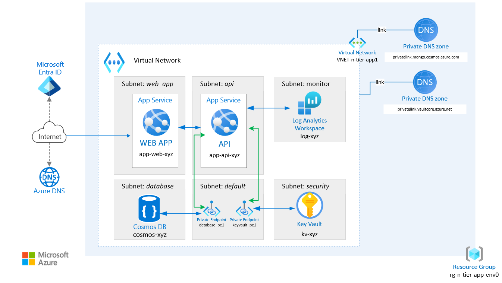

# Chapter 7 - Reverse Engineering

Welcome to Chapter 7! This chapter is a bit different from the previous ones. Your mission: implement changes in the architecture diagram on the portal. Let's get hacking!

1. **Analyze the Architecture**: Take a close look at the architecture diagram provided below
   
   
   
   You can also download the full architecture diagram here: [Download Full Architecture Diagram](./app-service-reference-architecture-complete.vsdx)

2. **Implement Changes**: Identify the areas that need improvement or modification and implement those changes directly in the Azure Portal.

Challenge yourself to complete these tasks on your own! If you encounter difficulties, continue with the following tasks and hints.

## Tasks and Hints

## Task 1 - Secure your Azure Cosmos DB in ``database`` subnet

1. Secure your Azure Cosmos DB in ``database`` subnet

📘 How-To Guide: [Configure virtual network based access for an Azure Cosmos DB account | Microsoft Learn](https://learn.microsoft.com/en-us/azure/cosmos-db/how-to-configure-vnet-service-endpoint)

💡 Hint 1: Find the Networking settings of the Cosmos DB

 

Go to your "Azure Cosmos DB for MongoDB account (RU)" resource on Azure Portal.

Under the "Settings" Section you will find the "Networking" section.

Open the Networking section and click the tab "Public access".

💡 Hint 2: Secure your Azure Cosmos DB with a VNET (Virtual Network)

 

Under "Public access" settings, select "Selected networks".

Click on "+ Add existing virtual network"

Select the VNET and ``database`` as subnet.

Click "add" and SAVE the configuration on "Public access" settings.

## Task 2 - Integrate your Key Vault resource to ``security`` subnet

2. Secure your Key Vault resource in ``security`` subnet

📘 How-To Guide: [Configure Azure Key Vault networking settings | Microsoft Learn](https://learn.microsoft.com/en-us/azure/key-vault/general/how-to-azure-key-vault-network-security?tabs=azure-portal)

💡 Hint 1: Find the Networking settings of the Key Vault

 

Go to your "Key vault" resource on Azure Portal.

Under the "Settings" Section you will find the "Networking" section.

Open the Networking section and click the tab "Firewalls and virtual networks".

💡 Hint 2: Secure your Key Vault with a VNET.

 

Select option to allow access from: "Allow public access from specific virtual networks and IP addresses".

Click on "+ Add a virtual network" and choose "+ Add existing virtual networks"

3. Select the `security` subnet and *apply* the changes.

## Task 3 - Isolate the Log Analytics Workspace

Enable network isolation for your Log Analytics Workspace to secure monitoring data and restrict access to authorized networks only.

📘 How-To Guide: [Enable network isolation for Azure Monitor Agent by using Private Link - Azure Monitor | Microsoft Learn](https://learn.microsoft.com/en-us/azure/azure-monitor/agents/azure-monitor-agent-private-link)

💡 Hint 1: Create an Azure Monitor Private Link Scope for your Resource Group

 

Create an Azure Monitor Private Link Scope resource for your Resource Group. This will serve as the foundation for establishing private connectivity to your Azure Monitor resources.

💡 Hint 2: Create a private endpoint for Azure Monitor

 

1. Navigate to "Azure Monitor Private Link Scopes" and locate your "Azure Monitor Private Link Scope" instance
2. Click on the instance to open its configuration
3. In the left sidebar, go to the Configure tab and select "Private Endpoint connections"
4. Click "+ Private Endpoint" to create a new endpoint

**Resource Configuration:**
- Resource type: `Microsoft.Insights/privateLinkScopes`
- Resource: `az-monitor-scope`
- Target sub-resource: `azuremonitor`

**Virtual Network Configuration:**
- Choose a compatible subnet (you can use the default subnet)

5. Create the private endpoint resource
6. After creation, navigate to Configure > "Azure Monitor Resources" and click "+ Add" to include your Log Analytics Workspace

📘 How-To Guide: [Configure private link for Azure Monitor](https://learn.microsoft.com/en-us/azure/azure-monitor/logs/private-link-configure)

💡 Hint 3: Configure Network Isolation settings in the Log Analytics workspace

 

1. Navigate to your Log Analytics workspace resource (starting with `log-`) in the Azure Portal
2. Under the "Settings" section, locate and click on "Network isolation"
3. Switch to the "Private access" tab and click "+ Add" to configure private access settings

💡 Hint 4: Disable public access for the Log Analytics Workspace

 

1. Go to your Log Analytics workspace resource (starting with `log-`) in the Azure Portal
2. Under the "Settings" section, find and click on "Network isolation"
3. Switch to the "Public access" tab and click "Manage"
4. Configure the access settings:
   - Set "Ingestion access" to "Secured by perimeter"
   - Set "Query access" to "Secured by perimeter"
5. Save your configuration changes

This configuration ensures that your Log Analytics workspace can only be accessed through the private network, enhancing the security of your monitoring infrastructure.

📘 Further Resources - Advanced Design: [Design a Log Analytics workspace architecture - Azure Monitor | Microsoft Learn](https://learn.microsoft.com/en-us/azure/azure-monitor/logs/workspace-design)
📘 Further Resources - Azure Monitor & Private Link: [Use Azure Private Link to connect networks to Azure Monitor - Azure Monitor | Microsoft Learn](https://learn.microsoft.com/en-us/azure/azure-monitor/logs/private-link-configure)

## Success Criteria 🎉

- 🎊 **Congratulations!** You have successfully completed all the challenges!

# Azure Well-Architected Framework

Finally, you can assess your environments using the Azure Well-Architected Framework which includes Microsoft Best Practices. Try the [Azure Well-Architected Framework](https://learn.microsoft.com/en-us/azure/well-architected/) on your environment and navigate through the questionnaire.

- Assess your environment using the [Azure Well-Architected Framework](https://learn.microsoft.com/en-us/azure/well-architected/).

## Success Criteria 🎉

- 🎊 **Congratulations!** You have successfully finished the Architecting on Azure Hack!

 **[< previous Chapter 6 - Azure Key Vault - RBAC Permissions](../chapter-6/README.md) |**