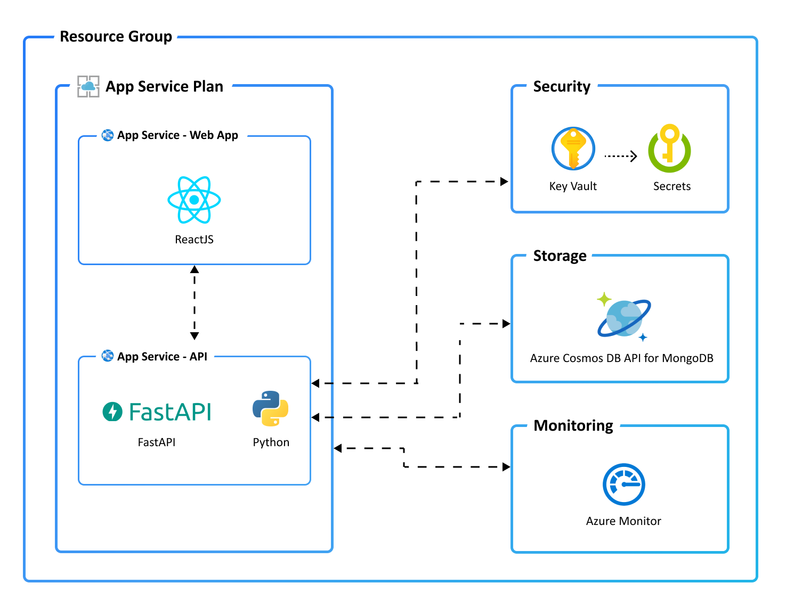

# Chapter 0 - How to Calculate SLA/Composite SLAs

An application or workload on Azure typically consists of multiple components or services rather than a single one. To assess the availability of such a workload, each component must be considered in conjunction with its interdependencies. Here, we leverage Service Level Agreements (SLAs) to perform these calculations.

## Service Level Agreements (SLA)

A Service Level Agreement (SLA) for Azure outlines Microsoft's commitments regarding the uptime and connectivity of Azure services. Each Azure service has its own specific SLA, detailing guaranteed availability and performance metrics.

### How Composite SLA is Calculated

💡 Consider your workload as a chain of interdependent components, where each component is a link in the chain. When one component's output serves as another component's input, they form consecutive links.

The composite SLA is calculated by multiplying the individual SLAs of each component service. This calculation assumes that the services are dependent on one another (logical AND relationship). For example, if you have two services with SLAs of 99.95% and 99.99%, the composite SLA would be:

0.9995 × 0.9999 ≈ 0.9994 or 99.94%

This means the combined availability is slightly lower than the individual SLAs.

### Impact of Composite SLA

* **Higher Probability of Downtime**: The composite SLA usually results in a lower overall availability percentage compared to the individual SLAs. This is because the application is only as reliable as its least reliable component. Hence, the saying **"a chain is no stronger than its weakest link."**
* **Critical for Architecture Planning**: Understanding the composite SLA is crucial for designing resilient applications. It helps in identifying potential points of failure and planning for redundancy and failover strategies.

### Find Out the Individual SLA for the TODO Application

> If you have completed the [ARCHITECTURE](../../2-ARCHITECTURE/README.md) hack, you will be familiar with the TODO Application.

The TODO Application allows users to add and complete TODO items.

### Task 1: Find the SLA for the Individual Azure Components in the TODO Application

💡 Hint: Use the SLAs

 

Find the latest SLA provided by Microsoft in [Service Level Agreements (SLA) for Online Services](https://www.microsoft.com/licensing/docs/view/Service-Level-Agreements-SLA-for-Online-Services?lang=1&year=2024).

### Task 2: Calculate the Composite SLA Using the Individual SLA

💡 Hint: Composite SLA Calculation

 

1. Identify the Azure services (components) that are connected.
2. Determine the chains of components within the application.
3. Use the latest SLA provided by Microsoft in [Service Level Agreements (SLA) for Online Services](https://www.microsoft.com/licensing/docs/view/Service-Level-Agreements-SLA-for-Online-Services?lang=1&year=2024) to find the SLA for each component in the chain.
4. Multiply the SLA values of each individual component (link) in the chain to get the composite SLA for that chain.
5. Identify the weakest link – the component/composites with the lowest SLA.

## Success Criteria 🎉

- 🎊 **Congratulations!** You now understand how to calculate Composite SLA and how it affects your architecture's reliability.

**| [next Chapter 1 - Zonal Redundancy >](../chapter-1/README.md)** |