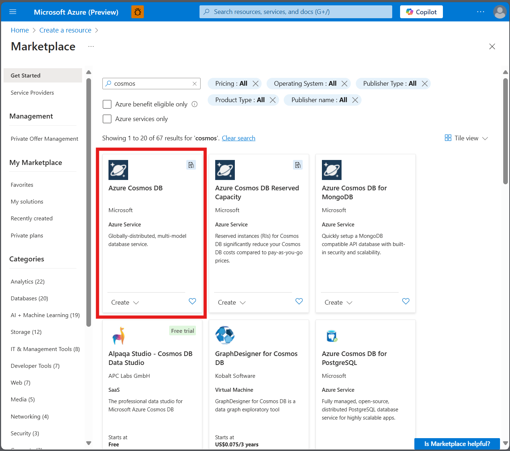
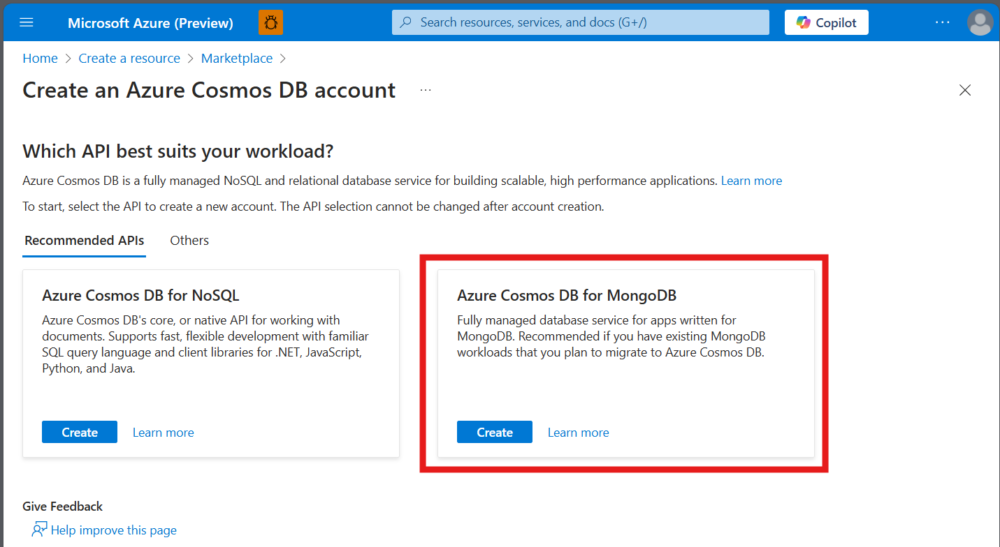
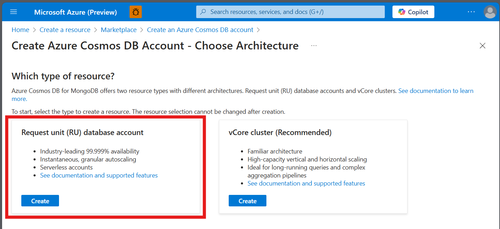
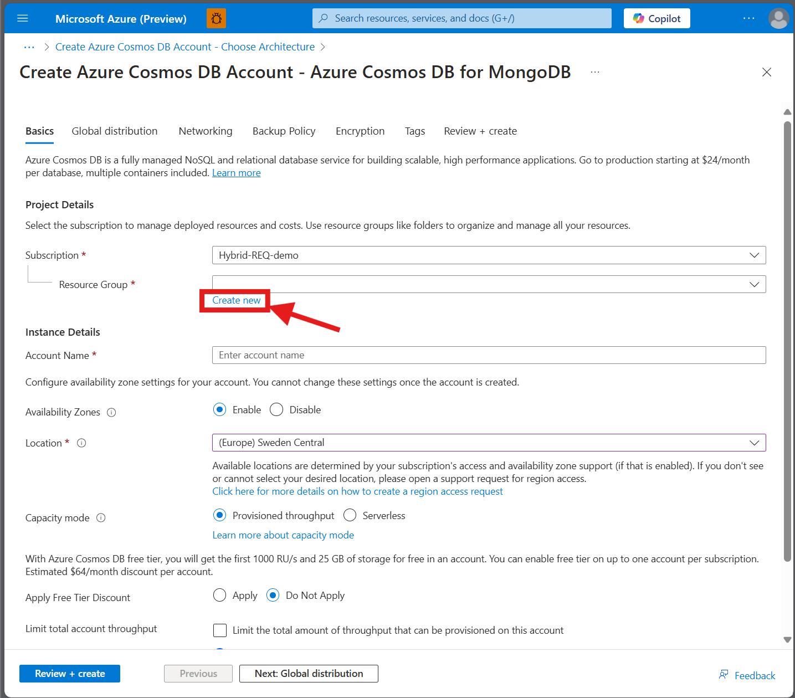
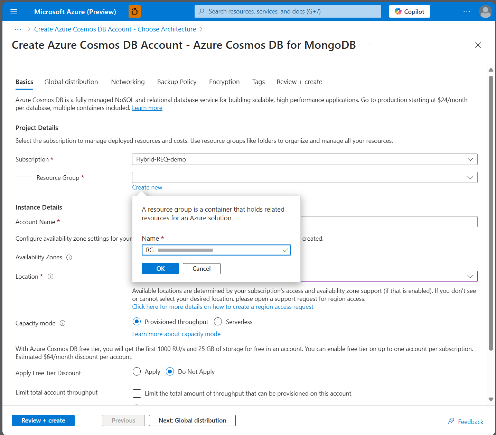
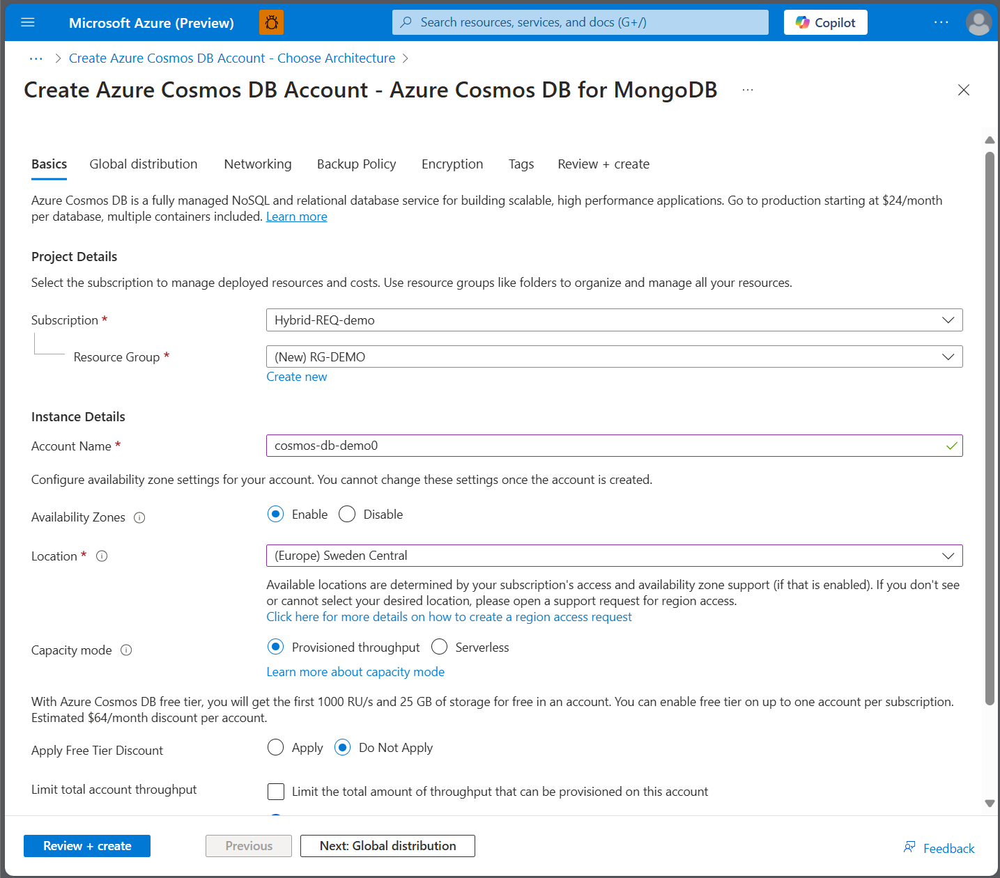
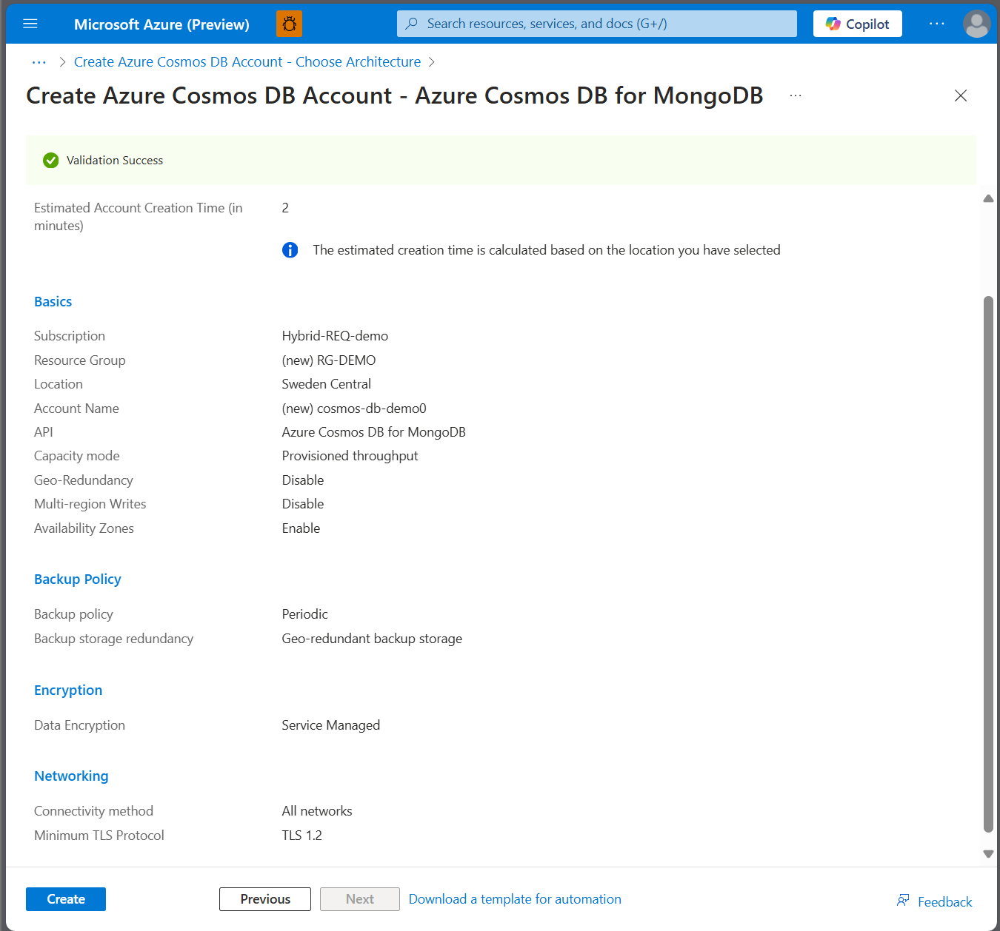
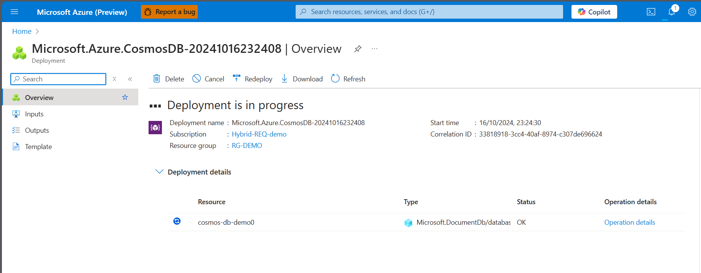
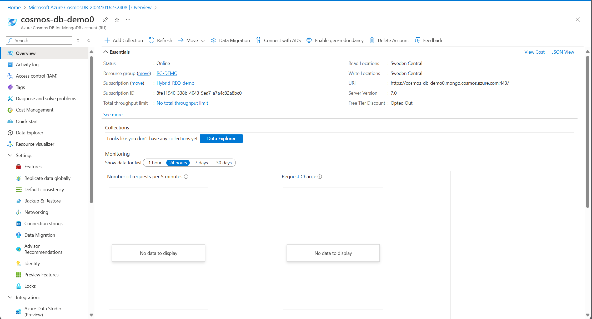

# Chapter 1 - Zonal Redundancy

Resiliency in Azure refers to the platform's ability to continue to operate with full or reduced functionality. Expect that component malfunctions, platform outages, performance degradations, limited resource availability, and other faults will occur. Building resiliency into your system ensures it is fault-tolerant and can degrade gracefully.

💡 **Learning Resources**:
- [Design for Resilience](https://learn.microsoft.com/en-us/azure/well-architected/reliability/principles#design-for-resilience)

# Setup and Deploy a Cosmos Database with a New Resource Group

## Task 1: Setup and Deploy an Azure Cosmos DB for MongoDB

This guide will walk you through the process of setting up and deploying an Azure Cosmos DB for MongoDB account within a new resource group.

1. **Create an `Azure Cosmos DB for MongoDB Account`**
   - Navigate to the Azure portal.
   - Select "Create a resource" and search for `Azure Cosmos DB for MongoDB account (RU)`.

2. **Create a New Resource Group**
   - During the `Cosmos DB` creation process, choose to create a new resource group.
   - Use a clear naming convention for the resource group, such as `RG-<your-descriptive-name>`.

3. **Create a container (or two)**
   - After your CosmosDB is deployed, go to Data Explorer and create a [container](https://learn.microsoft.com/en-us/azure/cosmos-db/nosql/how-to-create-container).

<details close>
<summary>💡 Example Solution </summary>
<br>

Below are the screenshots depicting the steps to create the resource group and the Cosmos DB account:

  
*Step 1: Navigate to create a new resource.*

  
*Step 2: Select Azure Cosmos DB for MongoDB.*

  
*Step 3: Click on "Create".*

  
*Step 4: Fill in the necessary details and choose "Create new" for the Resource Group.*

  
*Step 5: Provide a name for the Resource Group.*

  
*Step 6: Fill in the rest of the settings as needed.*

  
*Step 7: Review and create the Cosmos DB account.*

  
*Step 8: Deployment in progress.*

  
*Step 9: Deployment complete.*

</details>

## Task 2: Deploy Virtual Machines in Multiple Availability Zones

Deploy zone-resilient Azure virtual machines using the Azure portal.

📘 **How-To Guide:** 
- [Create a Linux Virtual Machine in the Azure Portal](https://learn.microsoft.com/en-us/azure/virtual-machines/linux/quick-create-portal?tabs=ubuntu)

Deploy two virtual machines with the following configuration:

| Setting                | Value            |
|------------------------|------------------|
| Virtual Machine Names  | vm1 / vm2        |
| Region                 | swedencentral    |
| Availability Options   | Availability Zone|
| Availability Zones     | Zone 1 / Zone 2  |
| Image                  | Ubuntu 22.04     |
| Security Type          | Standard         |
| Size                   | Standard B2s     |

For the **Disk** type, use **Premium SSD** LRS without ultra compatibility.

In **Networking**, use the default settings and employ the same network for the second machine.

<details close>
<summary>💡 Hint</summary>
<br>

For detailed instructions, please refer to the following resources:
- [Create a Linux Virtual Machine in the Azure Portal](https://learn.microsoft.com/en-us/azure/virtual-machines/linux/quick-create-portal?tabs=ubuntu)
- [AZ-104 Microsoft Azure Administrator Labs](https://microsoftlearning.github.io/AZ-104-MicrosoftAzureAdministrator/Instructions/Labs/LAB_08-Manage_Virtual_Machines.html)

</details>

Ensure you download the SSH key for each machine.

To connect to the virtual machines, use the SSH key and public IP address of each machine:

```bash
ssh -i ~/Downloads/myKey.pem azureuser@10.111.12.123
```

Once connected, you can install a web server to test out the failover later on:

```bash
sudo apt-get -y update
sudo apt-get -y install nginx
```

## Testing the Web Server

Open the web server page in your browser using the public IP of the machine.

## Create a Load Balancer

Now that you have two machines in different zones, create a **load balancer** to distribute traffic between them. Follow this configuration:

| Configuration        | Value                                       |
|----------------------|---------------------------------------------|
| **Name**             | `lbvms`                                     |
| **Type**             | Public                                      |
| **Frontend IP**      | Create new public IP (zone redundant)       |
| **Backend Pool**     | Choose the VNet and add both VMs            |
| **Load Balancing Rule** | IPv4, port 80, backend port 80, add new probe, use frontend IP |
| **Inbound NAT Rules**   | Use frontend IP, port range start at 50000, backend port 22, protocol TCP |

You now have a load balancer with a public IP address to reach the VMs. Test whether the IP of the load balancer loads the web server.

## Modify the NSG

If the web server does not load, modify the Network Security Group (NSG) for each machine:

Add the following inbound rule for the NSG of each machine:

| Configuration | Value   |
|---------------|---------|
| **Name**      | `HTTP`  |
| **Port**      | 80      |
| **Priority**  | 320     |
| **Protocol**  | TCP     |

After this, you should be able to see the web server using the public IP address of the load balancer.

## Task 3: Test Stopping One VM

With a redundant web server in different zones, if one zone goes down, the web server will continue to run in the other zone.

Let's test this!

Stop VM1 and check if you can still reach the web server using the load balancer. Then, stop VM2 and start VM1 again. Can you still see the web server?

💡 **Learning Resources**: 
- [Redundancy](https://learn.microsoft.com/en-us/azure/well-architected/reliability/redundancy)
- [What is Azure Load Balancer?](https://learn.microsoft.com/en-us/azure/load-balancer/load-balancer-overview)
- [What is Reliability?](https://learn.microsoft.com/en-us/azure/reliability/overview)

## Success Criteria 🎉

- 🎊 **Congratulations!** You have successfully deployed virtual machines across multiple zones and tested how the load balancer distributes traffic between the zones.
- ✅ **TODO Application:** You expanded the Cosmos DB database to multi-region redundancy.

**| [Next Chapter 2 - Data Redundancy >](../chapter-2/README.md)** | 
 **[< Previous Chapter 0 - How to Calculate SLA/Composite SLAs](../chapter-0/README.md)**