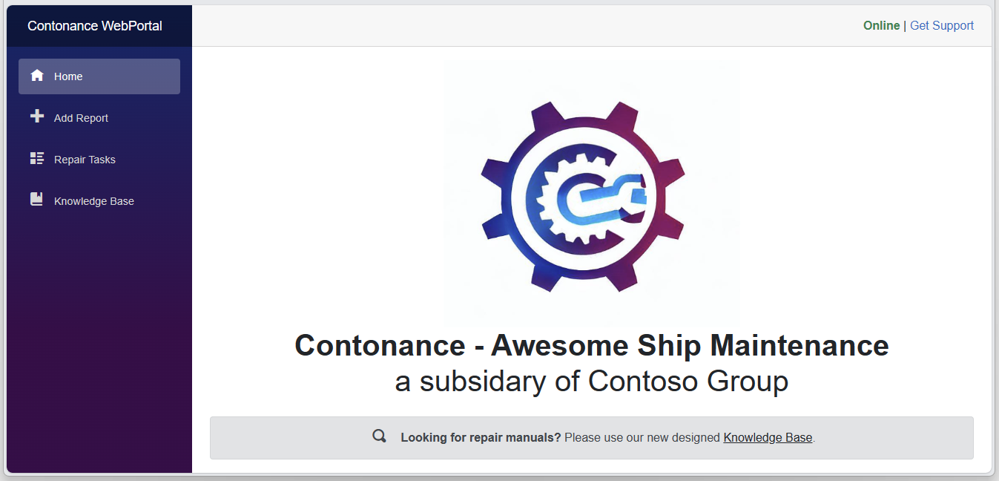
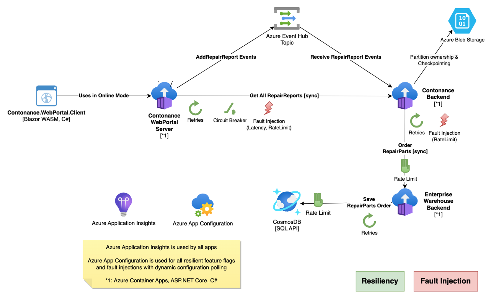

# Day 3: Azure Development Hackathon

## Welcome to Day 3! 💻

Today's intensive development hackathon focuses on building resilient microservices on Azure. You'll implement modern cloud-native applications using EventHub, AppConfig, Cosmos DB, and establish robust CI/CD pipelines with GitHub Actions, building upon the architectural principles learned on Day 2.

## Day 3 Schedule (8 hours)

**Full-Day Development Hackathon**
- Build resilient microservices following cloud-native patterns
- **Key Technologies**: EventHub, AppConfig, Cosmos DB, Container Apps
- **CI/CD Focus**: Deploy applications via GitHub Actions
- **Resilience Patterns**: Implement fault tolerance and observability

## Learning Objectives

By the end of Day 3, you will:
- ✅ Build and deploy resilient microservices on Azure
- ✅ Implement event-driven architectures with EventHub
- ✅ Use Azure App Configuration for feature management
- ✅ Deploy applications using GitHub Actions CI/CD
- ✅ Implement observability and monitoring patterns
- ✅ Apply resiliency patterns and fault injection testing

## Development Challenge Overview

Building resilient applications in Azure using microservices architecture! 

The Azure development hack teaches you to host, operate, and monitor microservices on Azure. During this hack, you'll work with Container Apps, CosmosDB, EventHub, Load Testing, and Application Insights while implementing the secure architecture patterns established on Day 1 and Day 2.

## Overview
Chaos engineering, fault injection testing, resiliency patterns, designing for failure - so many design principles and topics and still is reliability often times an afterthought.  
Let us run together a "game day" for resilience validation of our sample Azure application: **Contonance - Awesome Ship Maintenance, a subsidary of Contoso Group**.

As part of this hack we will take a look how we use **Azure App Configuration** to toggle various resilience scenarios, and how we measure, understand, and improve resilience against real-world incidents using **resiliency patterns and fault injections in code**.
We will also show you how you can use **Azure Monitor with Application Insights** combined with **Azure Loadtest** to compare and understand the availability impact of your patterns.

## High Level Architecture

## Challenges

- Challenge 1: **[Pre-requisites - Ready, Set, GO!](modules/module-1/readme.md)**
  - A smart cloud solution architect always has the right tools in their toolbox. 
- Challenge 2: **[First Thing First -  Overview - Build the apps ](modules/module-2/readme.md)**
  - Architecture overview
  - Building the Apps and pushing to the registry
  - 1 hr
- Challenge 3: **[Deplying the apps](modules/module-3/readme.md)**
  - Deploying Azure Container apps envioronment
  - Starting our microservices 
  - 1 hr
- Challenge 4: **[Enabling Monitoring ](modules/module-5/readme.md)**
  - Enabling application insights. 
  - Identify the tracing and performance.  
  - availability and health checks
  - 30-45 mins
- Challenge 5: **[ Bring the things together ](modules/module-4/readme.md)**
  - Deploying the built Application to Azure. 
  - Configuring the dependant services Eventhub, Cosmos and microservices
  - E2E application flow
  - Bonus : Use Keyvault instead of Env variables 
  - 1.5 hours 
- Challenge 6 - )**[Generating Load, building a baseline and scaling](modules/module-6/readme.md)**
  - Create a Load test
  - Observing Application scale behavior 
  - Observing test results against app backend
  - 45 mins
- Challenge 7: **[Enable Feature Flags, Triggering Errors, Implementing resilence and observing outcome](modules/module-7/readme.md)**
  - Overview of resiliency and fault injection patterns in application
  - Deploying App Configuration and Connecting microservices
  - invoking failures with load and monitoring
  - 45 mins
- Challenge 8: **[ A Blue Green deployment](modules/module-8/readme.md)**
  - Create and test new revision of application
  - Perform traffic spliting across revisions with Container apps 
  - 30 mins
- Challenge 9: **[ Front Door integration](module-/readme.md)**
  - Enable global availability of application and application acceleration 
  - 20 mins
 