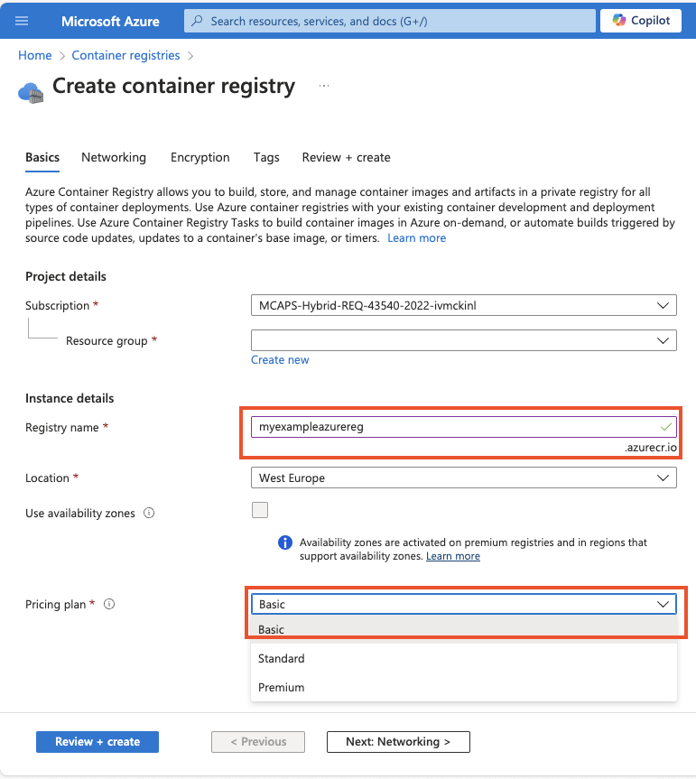

# Challenge 02 - build and push images to registry  

**[Home](../../Readme.md)** - [Next Challenge >](../module-3/readme.md)

## Introduction

In a previous challenge, we updated  prepare our developement environment and creates a resource group, Now with this challenge you will build your applications and  create a **Azure container Registry**. This will be used to store securely our application images

## Description

- Provision an **Azure Container Registry**(ACR) to push your images into it. 
* First we need to build the application.  Theres 3 applications that need to built
  * Contonance.Backend `acacontonancebackend:latest` found under Contonance.Backend/Dockerfile
  * EnterpriseWarehouse.Backend: `acawarehouse:latest` found under EnterpriseWarehouse.Backend/Dockerfil
  * Contonance.WebPortal `acawebportal:latest` found under Contonance.WebPortal/Server/Dockerfile 
- For this task. To avoid local docker build issues and dependencies. It is **strongly** recommended to use `az acr build`. 
  - This is feature pushes to code to ACR to be build remotely and simplifies the build process for the lab
  - Instead of performing local builds. Investigate using `az acr build ` to let ACR build the image instead  [acr build](https://learn.microsoft.com/en-us/azure/container-registry/container-registry-quickstart-task-cli)
> **Note**: As ACR is based on a globally available FQDN ensure that ensure you pick a unique name for you ACR
> 
> **Note**: For production environments should use an Infrastructure as Code language (Azure CLI, Bicep, Terraform, etc) to provision your Azure services. For these tasks its fine to use Azure Portal
## Tips 

Open hints

  - Images can be built locally and pushed to the registry. If running on Mac you may need to built on multi architecture. `docker buildx build   --platform=linux/amd64`
  - Instead of performing local builds. Investigate using `az acr build ` to let ACR build the image instead  [acr build](https://learn.microsoft.com/en-us/azure/container-registry/container-registry-quickstart-task-cli)
  - Ideally building images could be automated with github actions.  
  - Creating an ACR can be accomplished via the Portal Search "Container registry "
  - 
  - Use the basic sku and place it in the same region as your resource group.
  - To recreate this resource perhaps you think about automating. 
    - CLI/Bash  'az acr create '
    - Bicep [example](https://learn.microsoft.com/en-us/azure/container-registry/container-registry-get-started-bicep?tabs=CLI)
* [**Azure Container Registry**- Get Started with Azure CLI](https://learn.microsoft.com/en-us/azure/container-registry/container-registry-get-started-azure-cli)
* https://learn.microsoft.com/en-us/azure/container-registry/container-registry-tutorial-quick-task
* https://learn.microsoft.com/en-us/azure/container-registry/container-registry-tutorial-quick-task
* https://learn.microsoft.com/en-us/azure/container-registry/container-registry-authentication?tabs=azure-cli#individual-login-with-microsoft-entra-id

 

## Success Criteria 
- Validate that you can create an **Azure Container Registry**(ACR) `az acr list -o table`
- Validate that you can build images and push to the **Azure Container Registry** `az acr repository list -n $name`
- Built using `az acr build`
- Valaidate the 3 images are present in **Azure Container Registry**.

  
