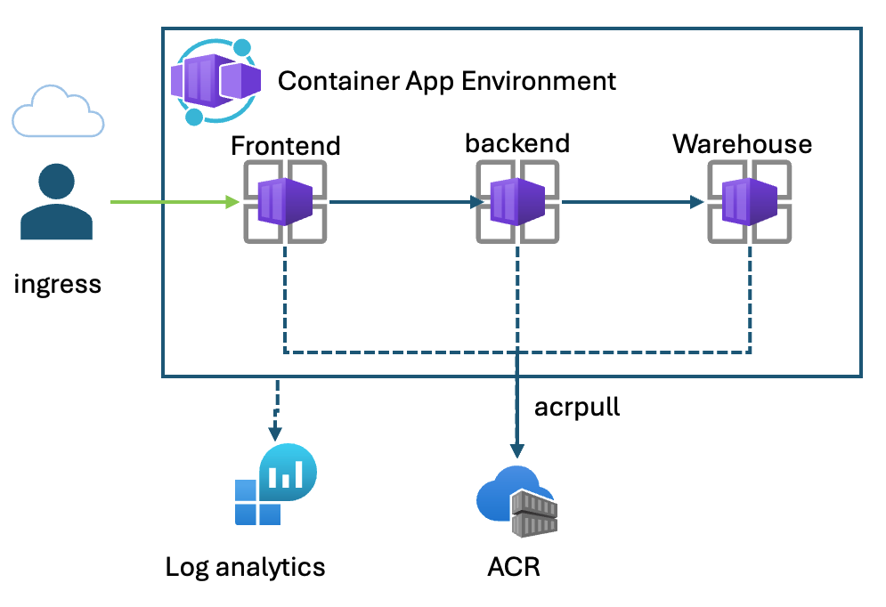
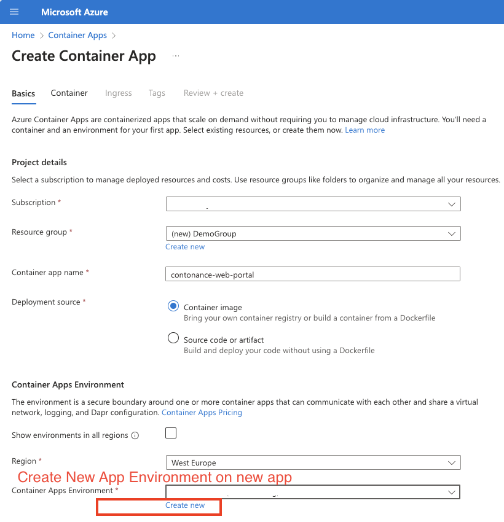
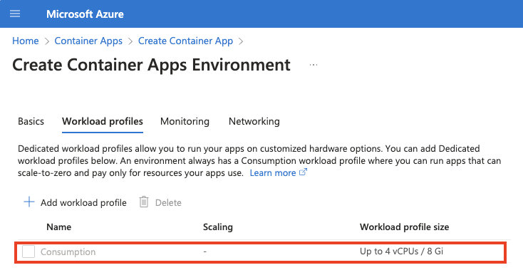
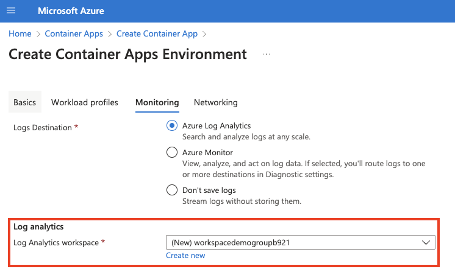
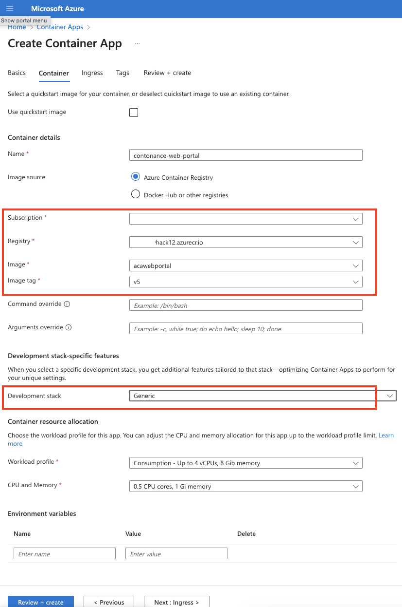
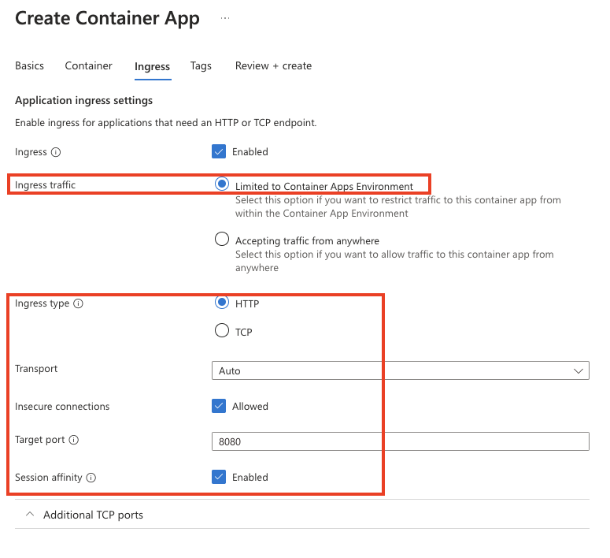

# Challenge 03 -  Starting up applications to Azure container

**[Home](../../Readme.md)** - [Next Challenge >](../module-4/readme.md)

## Introduction
Now that we have built the application and pushed them to an Azure container registry, we now want to start our application in Azure. In this challenge we will provision an Azure container apps environment and start the containers. As we have not deployed the applications dependencies the application will not be fully functional. Deploying and connecting to Cosmos and Eventhub will come in a the next lab.  
## Description 
Provision an Azure container Apps Environment based on the consumption tier. Deploy the previously built images into the new enviornment. Ensure the WebPortal is the only application publicaly accesible. The other applications should only be accessible within the App Environment. Since ACR is a private registry the containers will need to be authenicated to pull from ACR. Additionally the Azure Container App environment should be configured to send logs to log analytics. 
  

The Apps should be created under the following names 
* enterprise-warehouse-backend
* contonance-web-portal
* contonance-backend 

### Tasks
 * create an azure container app environment configured with logs analyticss
 * Deploy the previously built 3 images. Keep in mind the username and pasword for the image registry.. (or managed identity if possible for authenication)
 * 

## Hints   

<details>
  <summary> Open hints </summary>

* You can pre create the App Environment with CLI and reference it later when creating an App.
  * `az containerapp env create `
* The application should use the consumption workload profile  
  [Container apps quickstart]( https://learn.microsoft.com/en-us/azure/container-apps/get-started?tabs=bash )
  * `az containerapp env create `
* Configure the logging to be sent to log analytics workspace, [see](https://learn.microsoft.com/en-us/azure/container-apps/log-options)
  * This can be configured after creation or during app creation when setting up the app environment
* In the portal, A new App environment can be created when creating a container app
 
* The container app requires ACR pull role to be able to pull down the image from ACR 
* When creating an environment, use the consumption profile 
 
* When creating an environment ensure the logs configuration is setup. Either create a new log analytics namespace or reference another. This is used to query log data from containers  
 
* Deploying the app via the portal. You will need to grant access to the registry by enabling admin on the registry. For production this is not recommended 
  
* Deploying an internal ingress is exposed only to the App environment
  
* when Setting up ingress the backend target port can be determine from the Dockfile from the expose port.
  * `bash EXPOSE 8080` 
  * > Note: The expose directive may not always be defined on a dockerfile so it is recommened to understand what port the process within the container is listening to. 
* you can also use CLI to deploy and app to the preexisting App Environment. For example the following uses the ACR user name and password, references App Enviornment and passes applicaton environment variables  
* [log analytics cli](https://learn.microsoft.com/en-us/cli/azure/monitor/log-analytics/workspace/table?view=azure-cli-latest)
* [log analytics  quickstart](https://learn.microsoft.com/en-us/azure/azure-monitor/logs/quick-create-workspace?tabs=azure-portal)

```bash

          az containerapp create \
            --name contonance-web-portal \
            --resource-group $RESOURCE_GROUP \
            --environment $CONTAINERAPPS_ENVIRONMENT \
            --image $ACR_NAME.azurecr.io/$API_NAME:v2 \
            --target-port 8080 \
            --ingress external \
            --registry-username $ACR_NAME \
            --registry-password "$PASSWORD" \
            --registry-server $ACR_NAME.azurecr.io \
            --query properties.configuration.ingress.fqdn \
            --env-vars ApplicationInsights__ConnectionString=XXX EventHub__EventHubConnectionString=XXX EventHub__BlobConnectionString=XXX AppConfiguration__ConnectionString=XXXX 

``` 
</details>

## Success criteria 
- [ ]  Azure App Environment is deployed.
- [ ]  Logs from the App environment is sent and saved to a Azure log analytics workspace 
- [ ]  All 3 applications are deployed. 
- [ ]  Only the Webportal is publically accessible via the http port while the other 2 are only accessible within the App container environment
- [ ]  Ensure the 3 applications should have a min of 1 replica 
- [ ]  
 > Note: the application is not fully functional yet. For now we can just see they are started and 1 is accessible


## Learning check point 
  - [ ]  built images and pushed to our private repo
  - [ ]  We have deployed a container app environment 
  - [ ]  Deployed our images from our private repo to the environment


