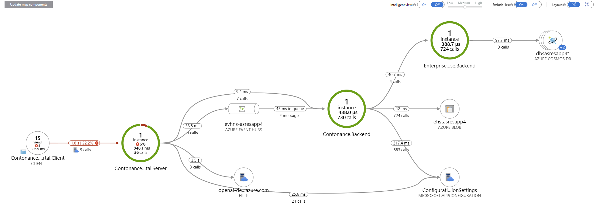
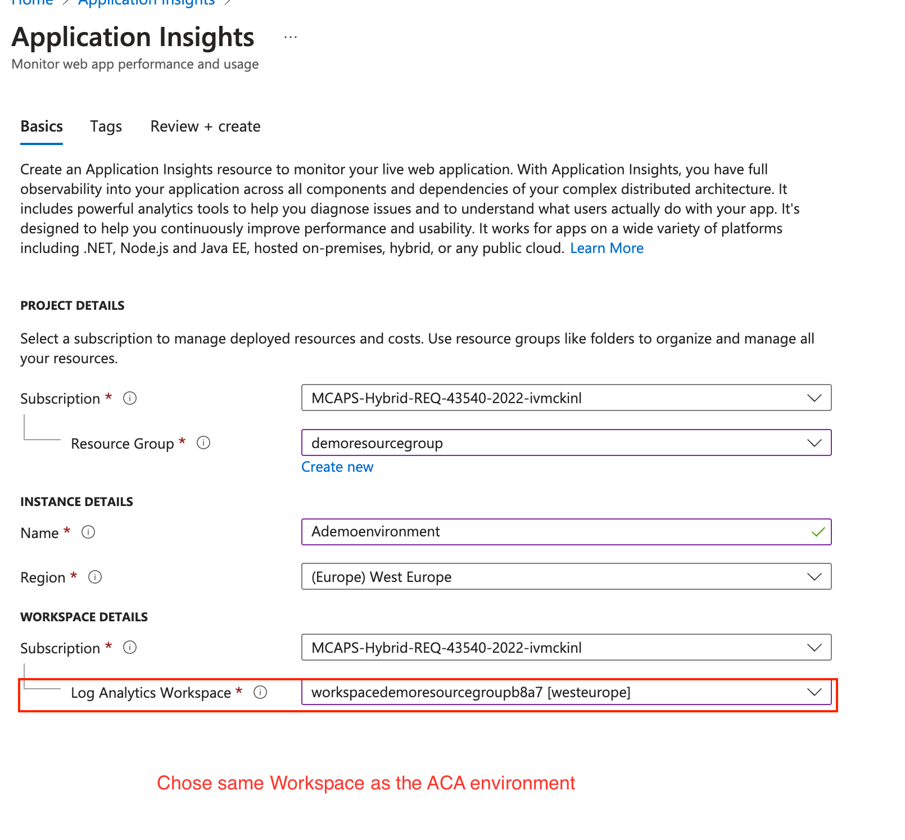

# Challenge 04 -  Add Application performance monitoring with Application insights  

**[Home](../../Readme.md)** - [Next Challenge >](../module-5/)

# Introduction 
In the next challenge we wired up the Microservice archtiecture inter-dependencies by.  
 * Deploying Eventhub for Async communication 
 * Deploying Comos DB to store a record of our repairs.  
 * Enabling both. 

Unfortunately it will be challenging to debug the application when an issue occured or a password/endpoint was incorrectly set. This becomes even more challenging in production when the issue is distributed over many instances. Without correct monitoring inplace you are forced to review each individual component. 
In this section we are going to use application insights and configure tracing and monitoring across the entire stack.  This will enable us to
- **Performance Monitoring:**  Tracks the performance of your application, including response times, failure rates, and dependency tracking.
- **Error Detection:** Identifies and logs exceptions and errors, helping you to diagnose and fix issues quickly.
- **User Insights:** Provides insights into user behavior and usage patterns, helping you understand how users interact with your application.
- **Availability Monitoring:** Monitors the availability of your application, ensuring it is up and running as expected.
- **Telemetry Data:** Collects telemetry data from your application, which can be analyzed to improve performance and user experience
 

## Description 
In this section we will. 
 - Provision an application insights instance. Ensure it uses the existing log analytics instance, provisioned with ACA. 
Each application needs to be configured to send data and telementry to app insights for correlation and analysis.
 - Review the Dockerfiles of the three applications and configure Applications insights key. All 3 applications are configured to be autoinstrumented and only require the connection string to be set.

### Tasks
 * Provision and application insights resource
 * Configure the ACA apps to send data to Appinsights with a connection string environment variable. inspect the docker files for the name and update the running applications with this new key value pair  
 *  Bonus: configure and availablity check. 

> Bonus: Once setup and data is coming into the monitoring tool. Instead of reactively waiting uses to interact with the app and discover potential outages. its possible to configure ping/availabilty tests against the system. It is recommeneded to set one of these up. You can perform a simple httpcode 200 check or perhaps check if theres a dedicated healthcheck to use
 

## Hints.  

  
 Open hints 

* [App insights overview ](https://learn.microsoft.com/en-us/azure/azure-monitor/app/app-insights-overview)
* Telementry [Collection](https://learn.microsoft.com/en-us/azure/azure-monitor/app/opentelemetry-overview)
* Using App Insights, how do i use and [How to navigate](https://learn.microsoft.com/en-us/azure/azure-monitor/app/overview-dashboard)
* Lets create an [App Insights](https://learn.microsoft.com/en-us/azure/azure-monitor/app/create-workspace-resource?tabs=bicep)  in the portal
* Lets create and [App Insights](https://learn.microsoft.com/en-us/cli/azure/monitor/app-insights/component?view=azure-cli-latest#az-monitor-app-insights-component-create) in the CLI
* Configure the [connection string](https://learn.microsoft.com/en-us/azure/azure-monitor/app/sdk-connection-string?tabs=dotnet5)
* Dockerfile references. Where the Application insights connection string can be set 
  * [contonance-web-portal](../../src/Contonance.WebPortal/Server/Dockerfile)
  * [contonance-backend](../../src/Contonance.Backend/Dockerfile) 
  * [enterprise-warehouse-backend](../../src/EnterpriseWarehouse.Backend/Dockerfile)
* [App insights cli  ](https://learn.microsoft.com/en-us/cli/azure/monitor/app-insights?view=azure-cli-latest)
* [App insights quickstart]( https://learn.microsoft.com/en-us/azure/azure-monitor/app/create-workspace-resource?tabs=bicep)
* Chosing the same log analytics workspace as ACA
  

## Create an Log analytics and App insights instance to monitor stack   
The app insights deployment should fullfil the following
 * Be based on kind=web
 * Should use a new or existing log analytics workspace. This workspace is where other components will send their logs 

## Success Criteria 
On completion of this lab
- [ ] Deploy an Application insights 
- [ ] Application insights reuses the same log analytics backend as ACA 
- [ ] All three applications instances are monitored and traced 
- [ ] Execute a application flow and review corrosponding telementry data in service map
- [ ] Inspect the peformance of an application flow and its logs
- [ ] Configure an availablity check 

## Learning check point 
  - [ ]  Our fully configured application is deployed on an serverless container platform 
  - [ ]  We have implemented E2E monitoring across the microservice stack