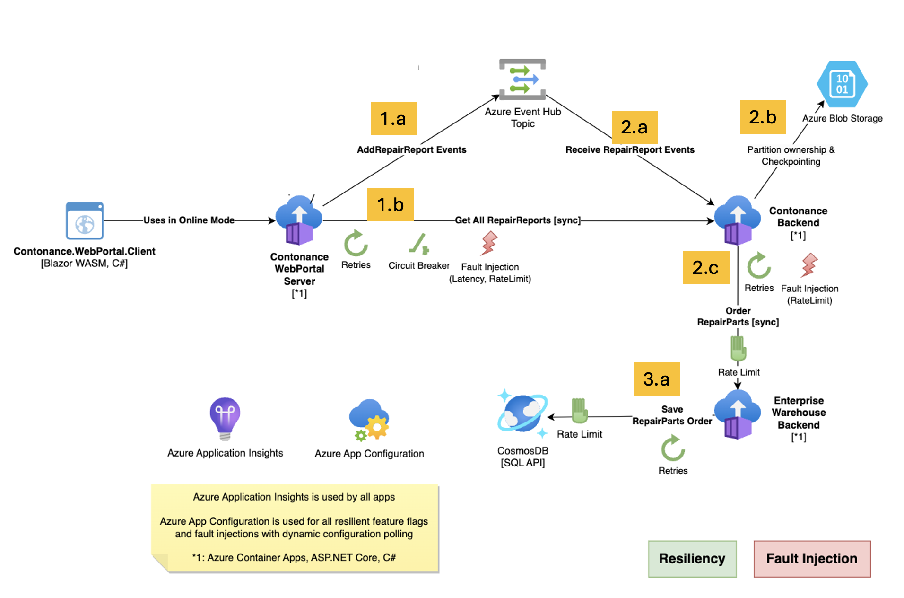
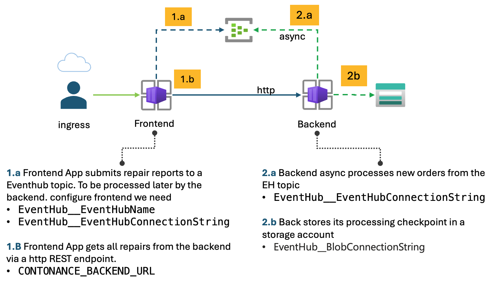
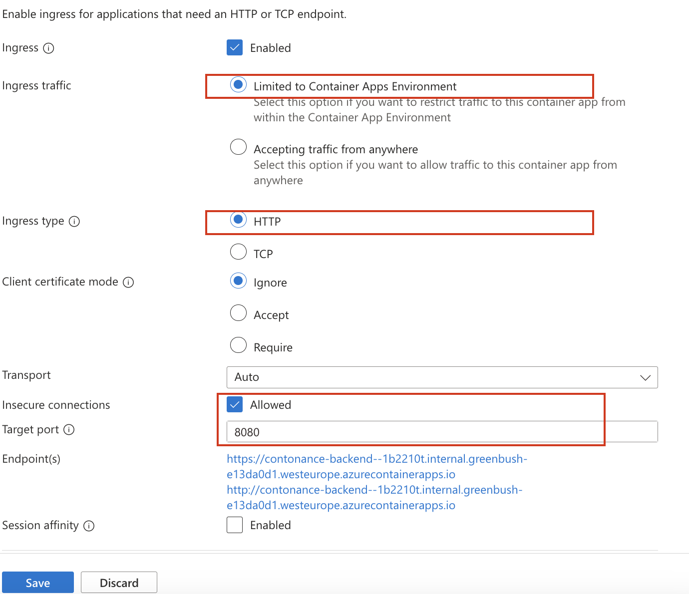
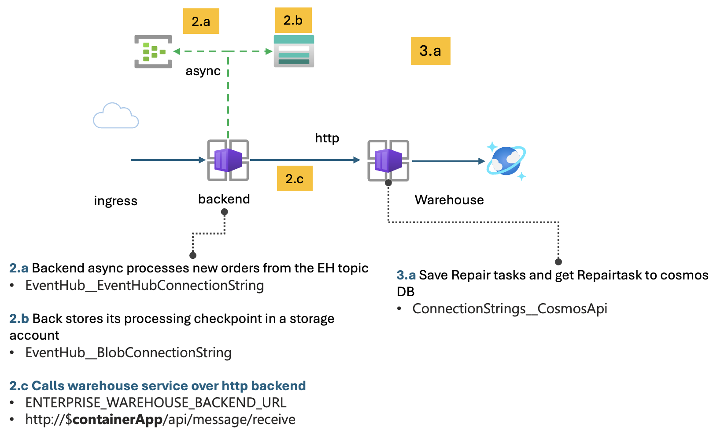
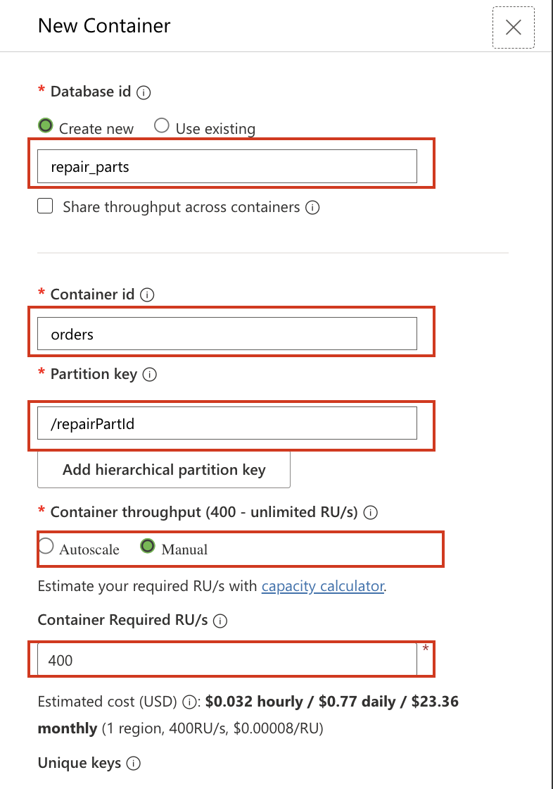
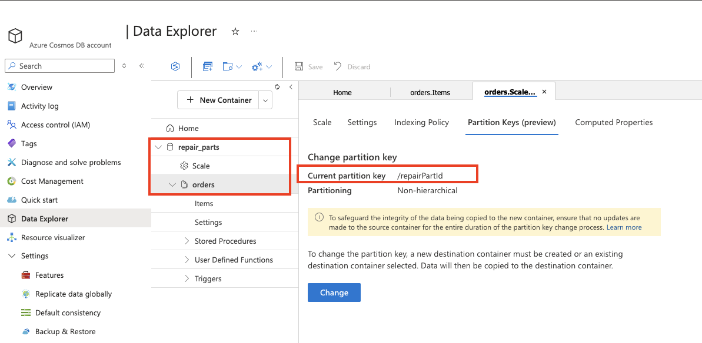
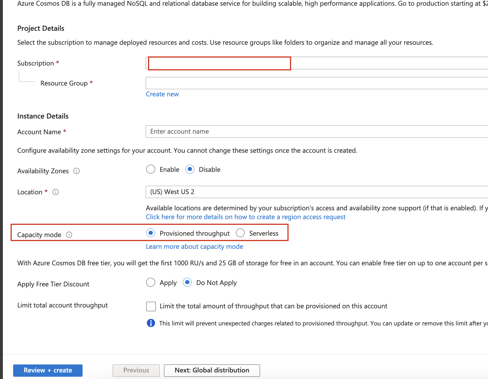
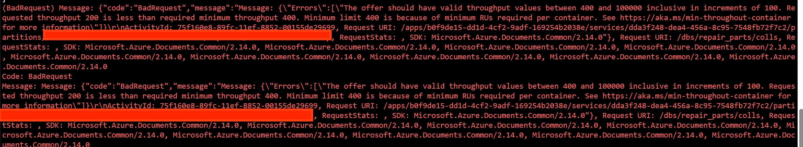
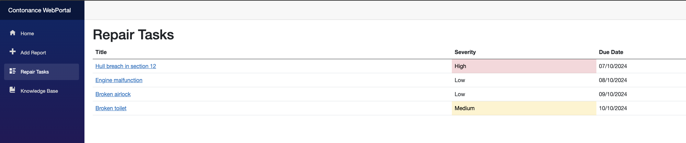
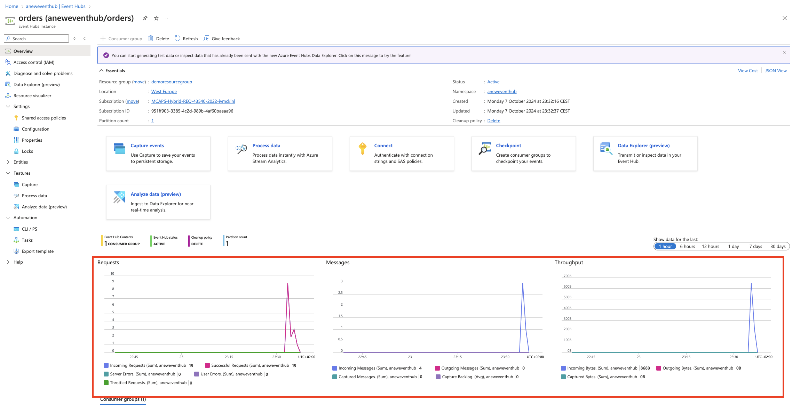

# Challenge 05 -  Wiring up the microservice components 

**[Home](../../Readme.md)** - [Next Challenge >](../module-6/)

## Introduction
Now that our applications are running. We need to wire these components together. This module is focused on deploying our supporting services and wiring the various components together. To achieve this we will be 
* Deploying an Azure Eventhub to enable async communication between fronend and backend 
* Deploying an Azure storage account to save event stream checkpoint used by eventhub client
* Deploying an Azure cosmosDB 
* Extracting the connection details for eventhub, storage account and cosmos db. These will be set them as environment variables. 
* Configuring the deployed container apps environment variables. 

## Description 
At a High level what we want to accomplish. Configure the WebPortal to communicate to Eventhub to submit repairjob **(1.a)** and also configure it talk to the Backend web service to get a list of RepairJobs **(1.b)**. On the backend we need to enable it to process **(2.1)** new Repair jobs from the eventhub and record its checkpoint **(2.b)** in the stream. The last microservice is configured to save data in cosmosdb 

 

 
> **Important**. It is **strongly** recommended to use  azure CLI to update the environment variables on your container apps. Using the Azure portal is convenient but is error prune and time consuming should the environment variables needs to be updated repeatedly.  The following is a example script that can be used to update environment variables on the 3 applications.
> 
> This cli script can be repeated executed to apply changes to the environment variables 

 ```bash

## Set the webportal env variables 
  az containerapp update \
    --name "contonance-web-portal" \
    --resource-group "$RESOURCE_GROUP" \
    --set-env-vars \
      EventHub__EventHubConnectionString="$event_hub_connection_string" 

## Set the backend env variables 
  az containerapp update \
    --name "contonance-backend" \
    --resource-group "$RESOURCE_GROUP" \
    --set-env-vars \
      EventHub__EventHubConnectionString="$event_hub_connection_string" \
      EventHub__BlobConnectionString="$blob_connection_string"

## Set the backend env variables 
  az containerapp update \
    --name "enterprise-warehouse-backend" \
    --resource-group "$RESOURCE_GROUP" \
    --set-env-vars \
      ConnectionStrings__CosmosApi="$ConnectionStrings__CosmosApi"

```

### 1: Configure communication between Frontend and Backend 
To enable communication between frontend and backend. 

In this task, you will create a Hub namespace and a Event Hub to enable asynchronous communication between the frontend and the backend.

 

* Create an Eventhub namespace. An **Event Hub namespace** is a logical container for Event Hubs in Azure. It acts as a management unit that groups multiple Event Hubs together. The namespace provides a unique FQDN (Fully Qualified Domain Name) that serves as the entry point for your Event Hubs, enabling you to organize and isolate your event streaming workload
* Create an **Event hub** called `orders`. An Event Hub is a fully managed, real-time data ingestion service by Azure. It handles large volumes of events and data streams, enabling real-time processing and analytics.
* Create a authorization rule. This allows clients to read and send data. Also known as a shared access policy. A policy with Read and Send is sufficent.

After the **Event Hub** is created and the connection access policy is defined the WebPortal/frontend application's environment variables can be set. 
* EventHub__EventHubConnectionString=
* See the Webportals [Dockerfile](../../src/Contonance.WebPortal/Server/Dockerfile) for details on the environment variables or search the code.
* Take care of the ingress is http of `contonance-backend` app. The backend port is 8080. 
* **Important** Ensure  that `Insecure connections`is enabled for ingress. 
 

### 2: Backend and Event Hub
 

The backend Microservice performs two Actions 
* Processes new Repair task from **Event hub** and save to warehouse service 
* Exposes API to show all repair tasks. 
* For connecting the Backend Microservice to the event hub we can use the connectionstring from previous step see [Dockerfile](../../src/Contonance.Backend/Dockerfile)
 * Configure the warehouse service endpoint.   see [Dockerfile](../../src/Contonance.Backend/Dockerfile)
 * lastly we need to save the checkpoint in a central storage. This is to ensure a repair task is not processed twice. For this we need to create a storage account and set its connection string on the Backend container.
* As containers are ephemeral, local state in a container does not survive a restart, we need to persist our eventhub checkpoints(processing poistion in the event stream) to remote distributed storage. This enables our applications to pick up processing where they left off should they encounter an disruption like a restart.(processing poistion in the event stream)

### 3 Warehouse: Connecting to Cosmos
The warehouse service communicates with a cosmos DB. The Warehouse microservice exposes an API `http://$containerApp/api/message/receive`. This api will save a new entry in the cosmos db. 
* We need to create a new cosmos Account and database based on NoSQL. This can be done in the `Cosmos DB account ´-> Data Explorer` menu item
* The warehouse expects a Cosmos db called `repair_parts` and a schema called `orders`. See schema screenshot.
* The orders schema will have a partitionKey of `repairPartId`. The creation process in the portal should look like the following.
  * database id = repair_parts
  * container id = orders 
  * partition id = repairPartId
  * Container Throughput = manual 
  * Container required RU/s = 400 
 
* After creation it should look like this in the data explorer sections
  
* Configure the warehouse service to connect to the DB. See [Dockerfile](../../src/EnterpriseWarehouse.Backend/Dockerfile) for the environment variable to set
## Hints 

<details>
  <summary> Open hints </summary>

### 1 WebPortal  -> Backend:  Create a EH namespace and Eventhub with CLI 
* Create an [Event Hub Namespace ](https://learn.microsoft.com/en-us/azure/event-hubs/event-hubs-create#create-an-event-hubs-namespace) in the portal. And create its corrosponding [Event Hub](https://learn.microsoft.com/en-us/azure/event-hubs/event-hubs-create#create-an-event-hub). The name of the eventhub created should be **orders**
* Once created, create an authorization rule. This will be passed as the **`EventHub__EventHubConnectionString`** environment variable. [Dockerfile](../../src/Contonance.WebPortal/Server/Dockerfile)
 
* https://learn.microsoft.com/en-us/azure/event-hubs/event-hubs-create
* Getting a Eventhub [Connection String](https://learn.microsoft.com/en-us/azure/event-hubs/event-hubs-get-connection-string). This will be passed as the **`EventHub__EventHubConnectionString`**  
#### Example EH script 
Exaample script to create the Eventhub resources and access configurations.
```bash 
# Create Event Hubs namespace
az eventhubs namespace create --resource-group $RESOURCE_GROUP --name $NAMESPACE_NAME --location $LOCATION --sku Basic
# Create Event Hub
az eventhubs eventhub create --resource-group $RESOURCE_GROUP --namespace-name $NAMESPACE_NAME --name $EVENTHUB_NAME
## Create Event Hub Authorization Rule
az eventhubs eventhub authorization-rule create --resource-group $RESOURCE_GROUP --namespace-name $NAMESPACE_NAME --eventhub-name $EVENTHUB_NAME --name listensend --rights Listen Send
### Show the key 
az eventhubs eventhub authorization-rule keys list --resource-group $RESOURCE_GROUP --namespace-name $NAMESPACE_NAME --eventhub-name $EVENTHUB_NAME --authorization-rule-name=listensend --query "primaryConnectionString" --output tsv

```
### 2 Backend  -> Warehouse: Connect to EH and  warehouse
* Configure the Backend application to connected to eventhub. Needs to be set `EventHub__EventHubConnectionString` 
* Use the same Auth rule as before for the connections String
* See backend [Dockerfile](../../src/Contonance.Backend/Dockerfile) for more details
* Create a Storage account get the connection string and set the environment variable on the Backend container app`EventHub__BlobConnectionString`. This will store the checkpoint

#### 2.1 Example Storage account 
Below is an example CLI script to create a storage account. This can also be performed in the Portal. The predefined defaults should suffice. The storage account is used to store the eventhub checkpoints. 
```bash 
az storage account create --name $STORAGE_ACCOUNT_NAME --resource-group $RESOURCE_GROUP --location $LOCATION --sku Standard_LRS
az storage account show-connection-string --name $STORAGE_ACCOUNT_NAME --resource-group $RESOURCE_GROUP --query "connectionString" --output tsv

```
#### 2.2 Enabling access keys on your storage account
> **Note:** It can be that your Azure subscription has disabled access keys by default on your storage account. You will see an error in the code if this is the case. You can enable access keys with the following script
 
```bash 
az storage account update     --name sa  --resource-group rg  --allow-shared-key-access false
```
### 3  Warehouse - Comos DB 
* create a new [cosmos db](https://learn.microsoft.com/en-us/azure/cosmos-db/nosql/quickstart-portal). NoSQL
 
*  [ComosDB  quickstart](https://learn.microsoft.com/en-us/azure/cosmos-db/nosql/manage-with-cli#create-an-azure-cosmos-db-account)
* we recommend for the lab to created **provisioned throughput** mode
*  
  
#### 2.1 Deploy a Cosmos DB 
We need to create a highly scalable Database to save the applications data and records. 
> **Important:**  When creating a cosmos DB, it requires a minimun for **400** throughput units. If you define less than **400** then the following error will occur 
 
* Create a SQL-based Azure Cosmos DB account.
  * `az cosmosdb create`
* Create a database within the Cosmos DB account.
   * `az cosmosdb sql database create`
* Create a Cosmos DB SQL Container
  * `az cosmosdb sql container create`
  * the partitionKey should be `repairPartId`
  * The container should be called 
  * [ComosDB  quickstart](https://learn.microsoft.com/en-us/azure/cosmos-db/nosql/manage-with-cli#create-an-azure-cosmos-db-account)

#### 3.2 Example Cosmos DB 
The following is an AZ CLI script that can be used as guidance to create the cosmosDB and configuration. 

```bash
## CosmosDB
az cosmosdb create --name $COSMOSDB_ACCOUNT_NAME --resource-group $RESOURCE_GROUP --locations  regionName=$LOCATION
az cosmosdb sql database create --account-name $COSMOSDB_ACCOUNT_NAME  --resource-group $RESOURCE_GROUP --name $DATABASE_NAME
az cosmosdb sql container create --account-name $COSMOSDB_ACCOUNT_NAME  --resource-group $RESOURCE_GROUP  --database-name $DATABASE_NAME --name $CONTAINER_NAME --partition-key-path "/repairPartId"   --throughput "400"

``` 
### 4 Environment variables overiview 
To assist with the environment variable configuration of containers. The following table maps which variables are the required to get the entire application chain up and running. 

| contonance-web-portal                     | Description                                                                 |
|-------------------------------------------|-----------------------------------------------------------------------------|
| `EventHub__EventHubConnectionString`      | The connection string for the Event Hub authorization rule.                 |


| contonance-backend                     | Description                                                                 |
|-------------------------------------------|-----------------------------------------------------------------------------|
| `EventHub__EventHubConnectionString`      | The connection string for the Event Hub authorization rule.                 |
| `EventHub__BlobConnectionString`          | The connection string for the Storage account to store the checkpoint.      |


| enterprise-warehouse-backend                     | Description                                                                 |
|-------------------------------------------|-----------------------------------------------------------------------------|
| `ConnectionStrings__CosmosApi`                  | The ComosDB connection String                                                  |


</details>


## Success criteria 
- [ ] Eventhub namespace and Eventhub deployed 
- [ ] Cosmos account created with a db called `repair_parts` and a schema called `orders`.
- [ ] Authorization rule created 
- [ ] Eventhub check point is used. Storing in Azure Blob storage
- [ ] Web Portal can submit successful a new Repair order 
- [ ] Web Portal can show a list a new Repair order 
- [ ] New repair items are save in comosdb. Verify in portal. 
 
- [ ] Verify incoming events into Azure Eventhub. This can be done by navigating to the overview of the Eventhub 
   
- [ ] Can you use keyvault instead of ENV variables. 

## Learning check point 
  - [ ]  We have deployed a container app environment 
  - [ ]  Started our customer applications
  - [ ]  Now we have configured the applications to communicate using common microservice patterns and Azure services

