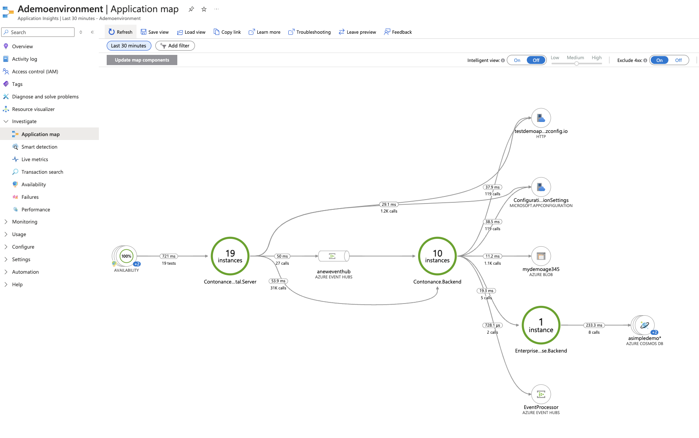
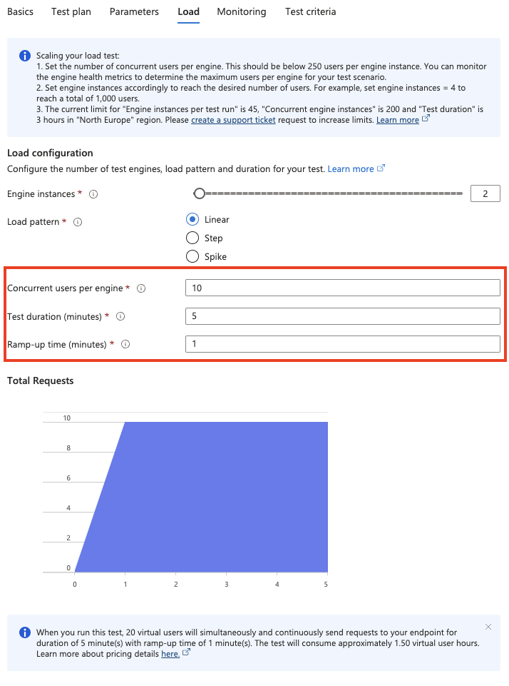
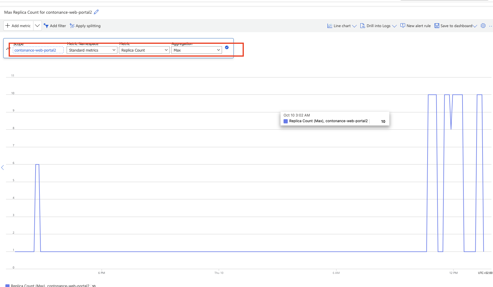
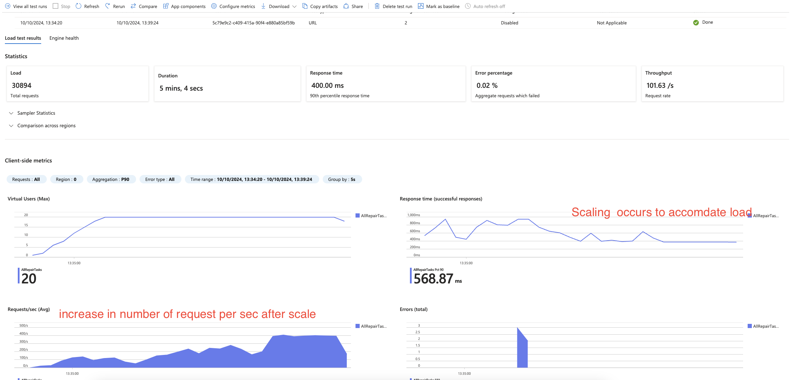
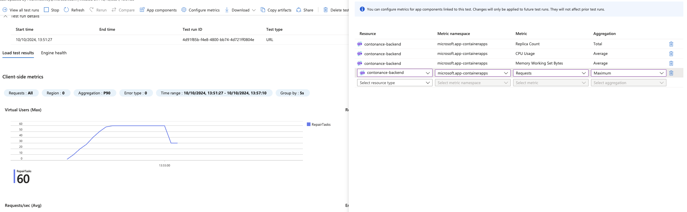

# Challenge 06 - Generating Load, building a baseline and scaling

**[Home](../../Readme.md)** - [Next Challenge >](../module-7/)

# Introduction 
In the last section we were able to enable full end to end monitoring across our stack. In this section we are going to use **Azure Load Testing** to generate virtual users against our application and define a performance baseline. In generating load we are going to demostrate the backends scaling to meet the added demand. In the next lab we will inject latency faults and demostrate the changes to our baseline. The next lab will introduce a latency fault that will allow us to observe the impact on our baseline.
## Description 

In this challenge you will create the Load Testing service in Azure and test against the URL `$WebPortal.URL/RepairReports`

Baselines help to determine the current efficiency state of your application and its supporting infrastructure. They can provide good insights for improvements and determine if the application is meeting business goals. Lastly, they can be created for any application regardless of its maturity. No matter when you establish the baseline, measure performance against that baseline during continued development. When code and/or infrastructure changes, the effect on performance can be actively measured.

 *  The Load test should test the /RepairReports endpoints on the WebPortal application. 
 *  The load test should with 30 concurrent users. Create the test for a duration of 7 mins with a rampup time of 1 minute 
 *  Throughout the load test the replica count of `contonance-backend` and  `contonance-web-poral` both increase to a default of 10 replicas. Scaling is by default based on 10 concurrent requests 
 *  As Part of the load test you should add the application components to monitor. 
  
### Analyze the Results:
* Once the test is complete, navigate to the Results section.
* Review the performance metrics such as response time, throughput, error rates, and more.
* Use the App insights observe and monitor the application through the load test.
   

## Hints.  

  
 Open hints 

### Create test
* The endpoint to test with GET is  `$contonance-web-portal/RepairReports`. This endpoint fetches the number of repair tasts.
* See documentation [load testing](https://learn.microsoft.com/en-us/azure/load-testing/quickstart-create-run-load-test-with-locust?tabs=portal)

### Example  params
* the following shows how to configuree a load test
 

### Replica count 
* Check the metrics section of each container app to observe if the application scaled during the load 

### Example result 
* Check the test report to understand what occured during tests 
  
* Ideally overlay reports with metrics from containers. For example the following overlay the scale activity with the load test metrics.

### Resources 
* https://learn.microsoft.com/en-us/azure/well-architected/performance-efficiency/performance-test
* https://learn.microsoft.com/en-us/azure/load-testing/how-to-parameterize-load-tests
* https://learn.microsoft.com/en-us/azure/load-testing/how-to-generate-load-from-multiple-regions

## Success Criteria 
- [ ] Azure Load test created
- [ ] Show your load tests run in **Azure Load Testing** service and what your performance baseline is.
- [ ] Observe the replicas have auto-scaled via the metrics. It should scale in after the tests
- [ ] Applications show performance metrics during the test time frame 
- [ ] Bonus: run the test from a different region. does it make a difference to latency

## Learning check point 
  - [ ]  Our fully configured application is deployed on a serverless container platform  and monitored E2E
  - [ ]  We have defined a baseline performance that can be used as a reference for any future changes 