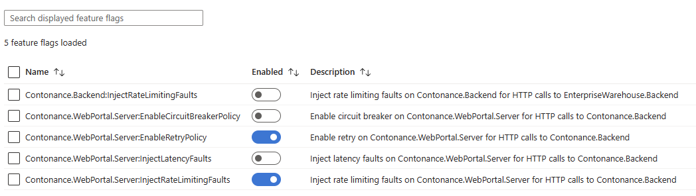
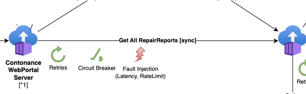
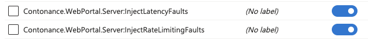
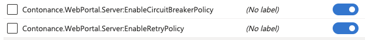
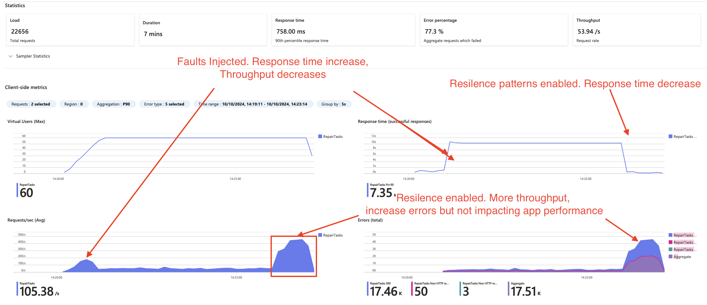

# Challenge 07 -  Enable Feature Flags, Triggering Errors, Implementing resilience and observing outcome  

**[Home](../../Readme.md)** - [Next Challenge >](../module-8/)

# Introduction 
In the last section we were able to enable full end to end monitoring across our application stack and implement load tests to replicate production usage.  In the this section we are going to use **Azure App Configuration** to pull down Application configuration and trigger faults to monitor and build resiliency into the architecture. We will observe our application performing poorly with fault injection and once we enable resiliency patterns the applications health will improve. 

> **Note** The applications is using a framework called polly to inject faults and implement application level resilence patterns.
> 
> Polly's fault injection allows you to simulate faults in your application to test it's resilience and error-handling capabilities. This is particularly useful for testing how your application behaves under failure conditions without actually causing real failures. The application is built to reach out to **Azure App configuration** and enable fault injection on demand.  

## Description 

Deploy **Azure App Configuration** service. The microservices use this service to store feature flags. This enable the applications and operator to turn on features in the services without requiring a application change or restart. 
> Note: Due to a special character limitation for `:` in the UI and CLI it's only possible to create these feature entries via Bicep.  We have supplied a bicep file with the required configuration   

In our case we will use **App Configuration** to 1) inject faults using this feature and 2) enabled resiliency patterns to mitigate these faults. 

### Feature flags
The application is configured to use the following feature flags.

| App                          | Feature Flag Key               | Feature Flag Description                                                                 |
|------------------------------|-------------------------------|-----------------------------------------------------------------------------------------|
| Contonance.WebPortal.Server  | EnableRetryPolicy               | Enable retry on Contonance.WebPortal.Server for HTTP calls to Contonance.Backend         |
| Contonance.WebPortal.Server  | EnableCircuitBreakerPolicy      | Enable circuit breaker on Contonance.WebPortal.Server for HTTP calls to Contonance.Backend |
| Contonance.WebPortal.Server  | InjectRateLimitingFaults        | Inject rate limiting faults on Contonance.WebPortal.Server for HTTP calls to Contonance.Backend |
| Contonance.WebPortal.Server  | InjectLatencyFaults             | Inject latency faults on Contonance.WebPortal.Server for HTTP calls to Contonance.Backend |
| Contonance.Backend           | InjectRateLimitingFaults        | Inject rate limiting faults on Contonance.Backend for HTTP calls to EnterpriseWarehouse.Backend |

For purpose of this task it is recommended to deploy using Bicep deployment file. This can be found [here](appconfig.bicep).
Create the App configuration using the supplied bicep [bicep](appconfig.bicep)

For this task we will inject faults between the Portal and Backend and then implement resiliency patterns to mitigate these faults. The faults will be injected on the GetAllRepairReports interface.

 


### Tasks
1. Deploy the App configuration service. Use the Bicep approach. 
2. Review the Docker files for all 2 applications and the App Configuration Connection String.  `AppConfiguration__ConnectionString`.  
3. For this exercise it's only required to set the `AppConfiguration__ConnectionString` on the WebPortal container
    * [WebPortal](../../src/Contonance.WebPortal/Server/Dockerfile) 
4. Once the environment variable is set and container restarted, verify the featues flags are updated by 
   1. Turning on `Contonance.WebPortal.Server:InjectLatencyFaults`in Azure portal
   2. Check webportal logs. You should see a message indicating feature flag was picked up
   3. Call the Webportal to list repairs page multiple time(refresh page). For the majority of page calls it should take longer to load. 
      1. Additionally this increased latency is visible in Application insights
   4. Once verified, disable the feature again. We will enable it again during a load test
   5. These resilience strategies and faults are controlled with App Configuration in [ContonanceBackendClient](../../src/Contonance.WebPortal/Server/Clients/ContonanceBackendClient.cs#30)
5. Start a loadtest against the API. You can use the same load test from the previous exercise. Where we defined a baseline in the last [lab](../module-6/challenge-6.md) 
6. Once the load test is running you can enable the features  `Contonance.WebPortal.Server:InjectLatencyFaults` and `Contonance.WebPortal.Server:InjectRateLimitingFaults`
 
   * After around 3-4 mins of the loads tests running against your fault injection. Enable the resiliency features
     
   * Observe the behaviour in the load tests. You should see a great throughput despite faults still occuring. This means the applications faults, while still occuring, are not effecting the performance of other succesful requests. 
   

## Hints.  
<details>
  <summary> Open hints </summary>

### Performing a bicep deployment
The following script accepts a parameter `appConfigStoreName` which is the name of the Azure App Configurtion.

 ```bash 
 az deployment group create --resource-group $RG --template-file appconfig.bicep --parameters appConfigStoreName=$appconfig
 ```
* [App Configuration  quickstart]( https://learn.microsoft.com/en-us/azure/container-apps/get-started?tabs=bash )

### Polly code 

The fault injection and  resilience strategies is p feature flags use the polly framework.  https://www.thepollyproject.org/. These resilience strategies and faults are controlled with App Configuration [ContonanceBackendClient feature flags](../../src/Contonance.WebPortal/Server/Clients/ContonanceBackendClient.cs#30). 

```csharp
        var retryPolicy = HttpPolicyExtensions
            .HandleTransientHttpError()
            .OrResult(msg => msg.StatusCode == System.Net.HttpStatusCode.TooManyRequests)
            .WaitAndRetryWithLoggingAsync(new[]
            {
                TimeSpan.FromSeconds(0.5),
                TimeSpan.FromSeconds(2),
                TimeSpan.FromSeconds(5)
            })
            .WithPolicyKey($"{nameof(ContonanceBackendClient)}RetryPolicy");


        var breakerPolicy = HttpPolicyExtensions
            .HandleTransientHttpError()
            .OrResult(msg => msg.StatusCode == System.Net.HttpStatusCode.TooManyRequests)
            .CircuitBreakerAsync(
                handledEventsAllowedBeforeBreaking: 3,
                durationOfBreak: TimeSpan.FromSeconds(30)
            );

        var injectRateLimitingFaultsPolicy = MonkeyPolicy.InjectResultAsync<HttpResponseMessage>(with =>
            with.ResultAndLog(new HttpResponseMessage(HttpStatusCode.TooManyRequests), LogLevel.Error)
                .InjectionRate(0.7)
                .Enabled()
            );

        var injectLatencyFaultsPolicy = MonkeyPolicy.InjectLatencyAsync<HttpResponseMessage>(with =>
            with.Latency(TimeSpan.FromSeconds(8))
                .InjectionRate(0.7)
                .Enabled()
            );

```

### Key and values 
* https://learn.microsoft.com/en-us/azure/azure-app-configuration/concept-key-value
### Best practises 
* https://learn.microsoft.com/en-us/azure/azure-app-configuration/howto-best-practices

* https://learn.microsoft.com/en-us/azure/templates/microsoft.appconfiguration/configurationstores?pivots=deployment-language-terraform

* https://learn.microsoft.com/en-us/azure/templates/microsoft.appconfiguration/configurationstores/keyvalues?pivots=deployment-language-terraform

</details>

## Success Criteria 
- [ ] **Azure App Configuration** service deployed.
- [ ] Review Polly code feature flags in [ContonanceBackendClient ](../../src/Contonance.WebPortal/Server/Clients/ContonanceBackendClient.cs#30)
- [ ] Feature flags set on **Azure App Configuration** service with Microservices dynamically enabling features. Verfied in logs and application behavior
- [ ] Fault injection feature flag set and resiliency patterns observed. These patterns can be observed either manually in the Web portal or via Load Test.

## Learning check point 
  - [ ]  Our fully configured application is deployed on a serverless container platform  and monitored E2E
  - [ ]  We have dynamically enabled features on our application and shown how to implement resiliency patterns that improve the availability of our application