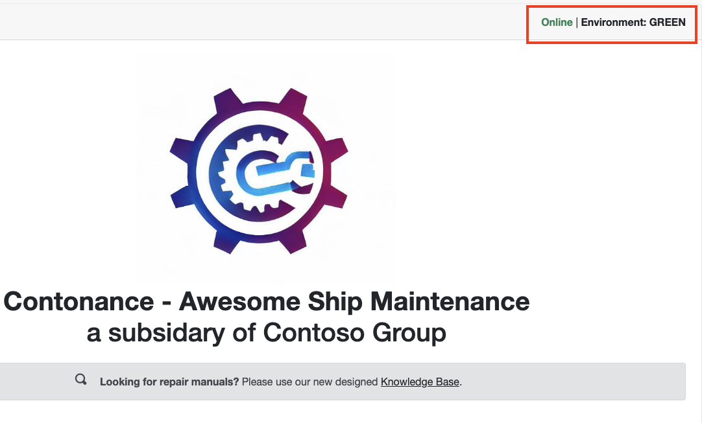
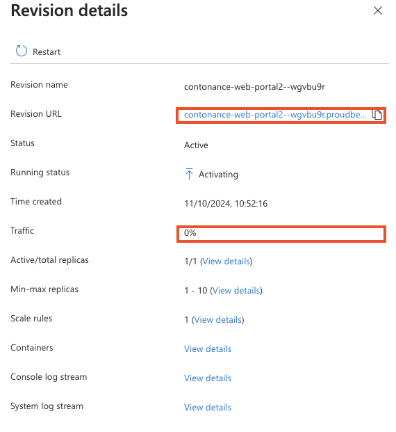

# Challenge 8 -  Performing traffic  splitting and Blue/Green deployments with revisions 

**[Home](../../Readme.md)** - [Next Challenge >](../module-9/)

# Introduction 
In this exerise we going to use Container Apps native features to perform Blue-Green deployments. The primary objective of running blue-green deployments in Azure Container Apps is to minimize downtime and reduce the risk of deployment failures by ensuring that a new version of the application (Green) can be tested in a production-like environment before fully replacing the old version (Blue)
   
   Blue-Green deployments involve maintaining two identical production environments: At any given time, only one of these environments (Blue) is live and serving production traffic. The other environment (Green) is used to deploy and test new versions of the application. The Green can be tested in isolation from production workload or together in production with traffic splitting (50/50)

## Blue/Green Benefits

**Minimized Downtime:** By deploying the new version in a separate environment, you can ensure that there is no downtime during the deployment process.

**Reduced Risk:** If any issues are detected in the Green environment, you can quickly revert traffic back to the Blue environment without affecting the end users.

**Seamless Rollback:** 
In case of any critical issues, you can easily switch back to the Blue environment, ensuring a seamless rollback process.

## Description 

For this lab you will be required to create an new application revision. By default Azure containers apps will only host 1 revision active. Thats why up until now we have seen rolling deployments and when a new version is deployed the previous one is shutdown. When we deploy a new revision, the new revision is available to be accessed under a revision url.
    

### Tasks
* Update container app to multi mode deployment configuration. This allows an application to have multiple concurrent revisons simulatiously.
* Make a change to the WebPortal application that would represent the latest version
* This could be any change in the application, such as webportal [menu](../../src/Contonance.WebPortal/Client/Shared/NavMenu.razor)
* For simplicity, theres an [environment variable](../../src/Contonance.WebPortal/Server/Dockerfile) called APP_VERSION that can be altered to represent the change. This field is displayed on the header of the application.
  

 * When a new revision of our application is created we will change this value, APP_VERSION
    
* you can test the new revision before switching it live. Load the revision's URL webportal and you should see the change
        

* Update the traffic routing to splitt   50% of our traffic to our new revision.
    
## Hints.  

  
 Open hints 

 ### Resources 
 * Create a new revision to deploy new updates to your app, or activate an [existing revision](https://learn.microsoft.com/en-us/azure/container-apps/revisions-manage?tabs=bash)
 * Your current revision will remain active, and you’ll be able to activate multiple revisions at the same time [More about multi-revision mode](https://learn.microsoft.com/en-us/azure/container-apps/revisions#revision-modes).
* More about multi-revision mode
*  Reusable Blue Green [Demo](https://github.com/denniszielke/blue-green-with-containerapps)
   

## Success Criteria 
 - [ ] Modifiy application to highlight the new version. Alter the APP_VERSION field. Setting to Blue or Green
 - [ ] Deploy a new revision of the application based on this new version. Test the new revision without making the revision active. The old application should still serve all the traffic
 - [ ] Perform 50/50 traffic splitting across the versions. Verify 50/50 split is occuring for users 
 

## Learning check point 
  - [ ]  Our fully configured application is deployed on an serverless container platform  and monitored E2E
  - [ ]  We have implemented mondern deployment practises such as Blue/Green using Azure container Apps native features