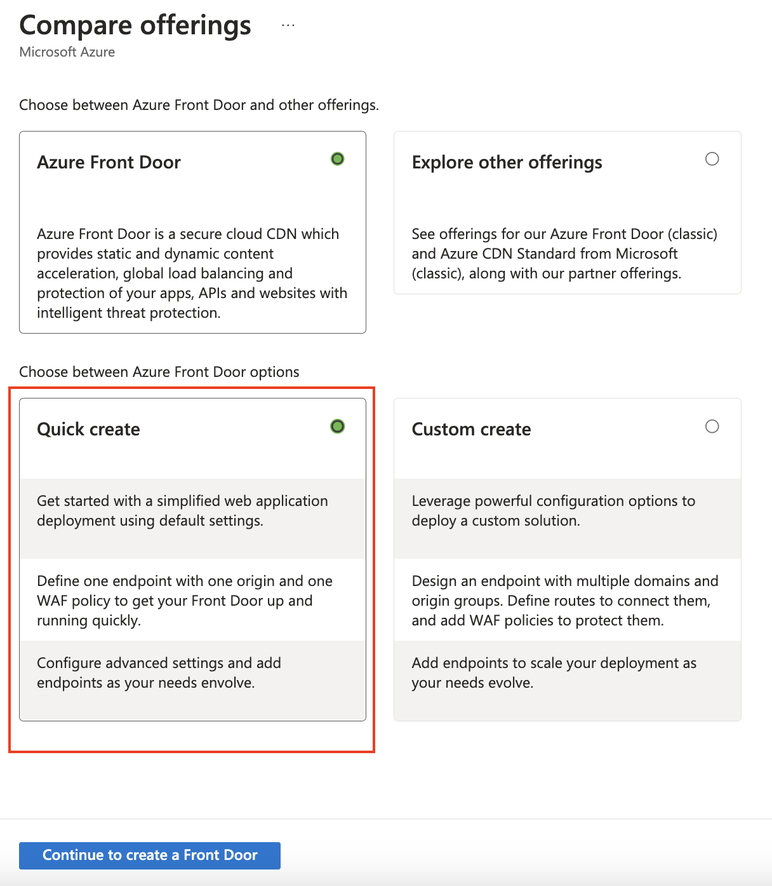
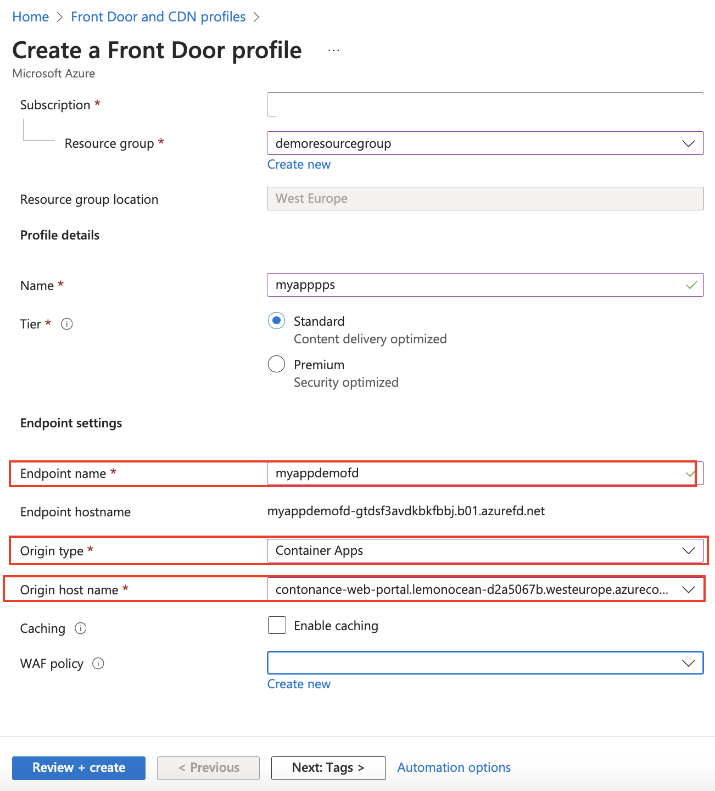

# Challenge 9 -  Application Acceleration with **Front Door**

**[Home](../../Readme.md)** - 

# Introduction
Azure **Front Door** is a scalable and secure entry point for fast delivery of your ACA hosted applications. By placing Azure **Front Door** in front of Azure Container Apps (ACA), you can enhance the performance, security, and reliability of your applications. Azure **Front Door** provides features such as global load balancing, SSL offloading, and application acceleration, which can significantly improve the user experience.
## Description 
In this challenge, you will configure Azure **Front Door** to act as the entry point for an application hosted on Azure Container Apps. The goal is to leverage Azure **Front Door**'s capabilities to enhance the performance and security of your application. You will:

* Create an Azure **Front Door** instance.
* Configure the **Front Door** to route traffic to your Azure Container Apps.
* We will use the provided Azure domains 
* Implement caching and other performance optimization features.
* Run load test against the **Front Door** endpoint and verify against previous baseline 
## Hints.  

  
 Open hints 

* Azure **Front Door** Documentation:  [Azure Front Door Documentation](https://learn.microsoft.com/en-us/azure/frontdoor/front-door-overview)
* Tutorial: Create a **Front Door** for a highly available web application: Create a **Front Door** for a [web application](https://techcommunity.microsoft.com/t5/apps-on-azure-blog/configure-container-app-with-front-door/ba-p/3814998)
* Caching and Performance Optimization: Caching and [Performance](https://learn.microsoft.com/en-us/azure/frontdoor/front-door-caching?pivots=front-door-standard-premium)
*  Azure Front Door integrates natively with Azure **Container Apps**. This makes it easy to configure in the portal. 
   *  Create a new Azure Front door and Select quickstart. 
   
   * Select **Container Apps** as origin type and then select the **origin** that you want to expose. This will be the Webportal app
   

   
## Success criteria 
- [ ]  Azure **Front Door** Instance Created: An Azure **Front Door** instance is successfully created and configured.
- [ ] Traffic Routing: Traffic is correctly routed from Azure **Front Door** to your Azure Container Apps.
- [ ] Testing: The application is tested to ensure that it is accessible through Azure **Front Door** and that performance and security enhancements are in place.