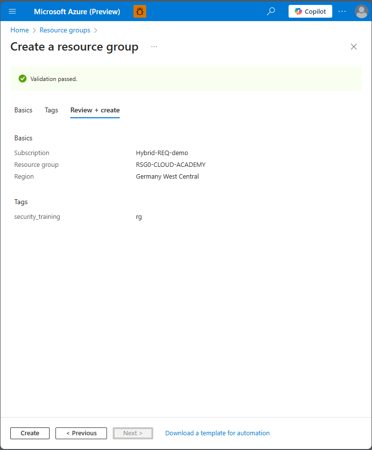
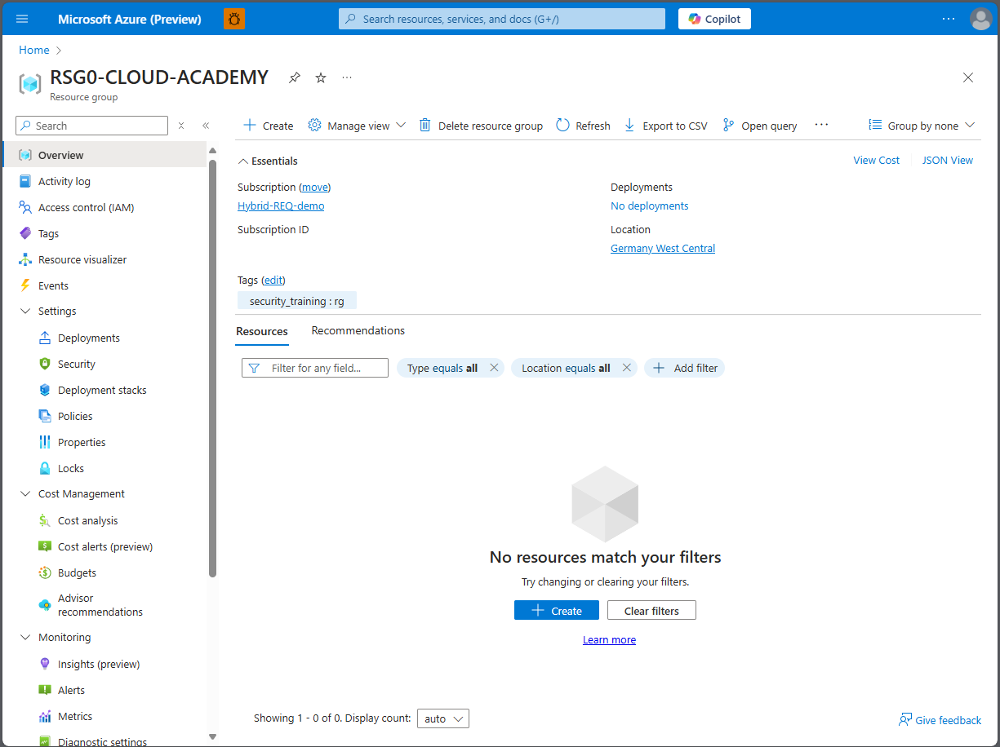

# Module 1 - Authentication and Authorization
### Securing Identities and Access Permissions

- **Review Identity Provider Architecture for Azure and Applications**

## Hands-On Tasks:

### Task 1: View Logged-In User Identity and Current Permissions
**Instructions**: Explore how to view the current user’s identity and permissions in Azure.  
**Success Criteria**: Participants should list:
  - User principal name
  - Group memberships
  - Assigned roles
  - Assigned licenses
  - User type

<details close>
<summary>💡 Hint: List my credentials and permissions</summary>
<br>

### Task 1: View Logged In User Identity and Current Permissions
1. Log in to the [Azure Portal](https://portal.azure.com) with an Azure-enabled user account.
2. Navigate to the [Entra ID](https://portal.azure.com/#view/Microsoft_AAD_IAM/ActiveDirectoryMenuBlade/~/Overview) section.
3. Locate your user account by entering your credentials into the search bar.
4. Review the following details:
   - User Principal Name (UPN)
   - Group Memberships
   - Assigned Roles
   - Assigned Licenses
   - User Type

   

   

</details>

### Task 2: Assign Roles to Resources and Resource Groups
**Instructions**: Assign different roles to resources and resource groups in Azure.

**Success Criteria**:
1. Resource Group (RG) created.
2. Storage account created in RG with proper permissions.

#### Task 2.1: Create a Resource Group
📘 **How-To Guide**: [Step-by-Step Guide: Creating an Azure Resource Group on Azure Portal](https://techcommunity.microsoft.com/t5/startups-at-microsoft/step-by-step-guide-creating-an-azure-resource-group-on-azure/ba-p/3792368#:~:text=Learn%20how%20to%20create%20an%20Azure%20Resource%20Group%20with%20this)

<details close>
<summary>💡 Hint 1: Create a Resource Group</summary>
<br>

### Step 1: Create a Resource Group

You can create a resource group either through the Azure CLI or the Azure Portal.

#### Option 1: Using Azure CLI

Execute the following command to create a resource group:

```sh
az group create --name MY_GROUP_NAME_HERE --location MY_LOCATION_HERE
```

**Example:**

```sh
az group create --name MY_RG_CLOUD_ACADEMY --location southafricanorth
```

#### Option 2: Using Azure Portal

1. Go to the [Azure Portal](https://portal.azure.com/#create/Microsoft.ResourceGroup).
2. In the "Create a resource group" form:
   - **Subscription**: Select the subscription under which to create the resource group.
   - **Resource group**: Enter a name for the new resource group.
   - **Region**: Select an [Azure Region](https://azure.microsoft.com/en-us/explore/global-infrastructure/geographies/?msockid=2508f470901c684f1c68e76491fc69d9) (choose one of the closest ones).

   
   
   

3. Select `Review + create`.
4. After passing the review, click `Create`.

   

</details>

## Checkpoint 0 🎉
🎊 **Congratulations!** You have successfully created a Resource Group. It is a great place to store your resources.


💡 **Learning Resources**:
- [What is a resource group?](https://learn.microsoft.com/en-us/azure/azure-resource-manager/management/manage-resource-groups-portal#what-is-a-resource-group) 
- [Organize your Azure resources effectively - Cloud Adoption Framework | Microsoft Learn](https://learn.microsoft.com/en-us/azure/cloud-adoption-framework/ready/azure-setup-guide/organize-resources)


#### Task 2.2: Create a Storage Account
**Instructions**: Create a Storage account in the Resource Group created in the previous task.

📘 **How-To Guide**: [Create an Azure storage account](https://learn.microsoft.com/en-us/azure/storage/common/storage-account-create?tabs=azure-portal)

<details close>
<summary>💡 Hint 2: Create a Storage account in the Resource Group</summary>
<br>

### Step 2: Create a Storage Account

You can create a storage account using either the Azure CLI or the Azure Portal.

#### Option 1: Using Azure CLI

Run the following command in your terminal, ensuring you replace the placeholder values with your actual parameters:

```sh
az storage account create --resource-group MY_GROUP_NAME_HERE --name MY_STORAGE_ACCOUNT_NAME_HERE --location MY_LOCATION_HERE --sku Standard_LRS --kind StorageV2
```

**Example:**

```sh
az storage account create --resource-group MY_RG_CLOUD_ACADEMY --name mystrgaccafr1 --location southafricanorth --sku Standard_LRS --kind StorageV2
```

**Important:** Pay close attention to the parameters you use!

#### Option 2: Using Azure Portal

1. Navigate to your Resource Group in the [Azure Portal](https://portal.azure.com).
   

2. Search for "storage account" in the Marketplace.
   

3. Configure the storage account settings, ensuring to choose a unique name for the storage account.
   

4. Review the configuration parameters.
   
   
   

5. Select `Review + create`. After the validation review passes, click **Create**.
   

</details>

## Checkpoint 1 🎉
🎊 **Congratulations!** You have successfully created a storage account and placed it in your Resource Group.


💡 **Learning Resources**:
- [What is Azure Blob storage?](https://learn.microsoft.com/en-us/azure/storage/blobs/storage-blobs-overview)
- [Storage account overview - Azure Storage | Microsoft Learn](https://learn.microsoft.com/en-us/azure/storage/common/storage-account-overview)

💡 **Encryption of data at rest**:
- [Azure encryption overview | Microsoft Learn](https://learn.microsoft.com/en-us/azure/security/fundamentals/encryption-overview)
- [Require secure transfer to ensure secure connections - Azure Storage | Microsoft Learn](https://learn.microsoft.com/en-gb/azure/storage/common/storage-require-secure-transfer)
- [Remediate anonymous read access to blob data - Azure Storage | Microsoft Learn](https://learn.microsoft.com/en-gb/azure/storage/blobs/anonymous-read-access-prevent?tabs=portal)
- [Enforce a minimum required version of Transport Layer Security (TLS) for incoming requests - Azure Storage | Microsoft Learn](https://learn.microsoft.com/en-gb/azure/storage/common/transport-layer-security-configure-minimum-version?tabs=portal&WT.mc_id=Portal-Microsoft_Azure_Storage)
- [Prevent authorization with Shared Key - Azure Storage | Microsoft Learn](https://learn.microsoft.com/en-gb/azure/storage/common/shared-key-authorization-prevent?tabs=portal)


### Task 2.3: Check and Set Permissions
**Instructions**: Navigate to the IAM model to check and set access permissions.


- Click "View my access" to check current permissions.

<details close>
<summary>💡 Hint: View and check access permissions </summary>
<br>

### Reviewing Access Control (IAM) in Your Resource Group

1. Navigate to your Resource Group resource in the Azure Portal.
2. From the left-hand menu, select the **Access control (IAM)** section.

#### Reviewing Your Own Access

1. Click on **View my access**.
   

#### Reviewing Access for a Specific User or Resource

1. Click on **Check access**.
   
</details>

### Task 3: Configure Azure Roles (Owner, Contributor, Reader, and Custom Roles)
**Instructions**: Assign the required permissions to your colleague to access your resource group for security reviews.

**Success Criteria**: At least one additional user is assigned to the group with Reader permissions.

📘 **How-To Guide**: [Assign Azure Roles Using the Azure Portal - Azure RBAC | Microsoft Learn](https://learn.microsoft.com/en-us/azure/role-based-access-control/role-assignments-portal)

### Assign the Security Reader Role to Your Colleague
[Azure Built-In Roles - Azure RBAC | Microsoft Learn](https://learn.microsoft.com/en-us/azure/role-based-access-control/built-in-roles)

<details close>
<summary>💡 Hint: Assign the Security Reader Role</summary>
<br>

- **Assign the Security Reader permissions.**
  - 1. Navigate to your Resource Group created in the previous exercise.
  - 2. On the left navigation bar, find "Access control (IAM)" section.
  - 3. Go to the "Access control (IAM)" section, click "+ Add" and then, in the drop-down menu, click "Add role assignment".
  
  
  - 4. On the Add role assignment blade, specify the following settings and click Next:


  - 5. On the Member assignment blade, specify user you would like to add and click Next:


  - 6. Click "**Review + assign**" to create the role assignment.
</details>

## Task 4: List a User's Permissions on a Storage Account

### Instructions
Check the permissions that have been assigned to a specific user on your storage account.
### Success Criteria
- You should be able to find the user in the storage account's access control list and identify both the scope of their permissions and their assigned role.
  
<details close>
<summary>💡 Hint: Use the "Check access" feature in the storage account's Access control (IAM) section to list the user's permissions </summary>
<br>

### Checking Access for a User in a Storage Account

1. Go to your **Resource Group**. Open the previously created Storage account.
2. Navigate to the **Access control (IAM)** section.
3. Select the **Check access** tab.
4. In the **Search by name or email address** text box, enter the name or email address of the user.
5. Locate the user and identify their assigned role:


</details>

## Success Criteria 🎉

- 🎊 **Congratulations!** You have successfully listed and identified a user's permissions on the storage account.

💡 **Learning Resources**:
- [What is Azure role-based access control (Azure RBAC)? | Microsoft Learn](https://learn.microsoft.com/en-us/azure/role-based-access-control/overview) 
- [Understand the different roles | Microsoft Learn](https://learn.microsoft.com/en-us/azure/role-based-access-control/rbac-and-directory-admin-roles)

 **| [next Module 2 - Securing Networks >](../module-2/README.md)**
