# Module 5: Securing Data in Use - Confidential Virtual Machines

## Task 1: Deploy a Confidential VM and a Confidential Boot Disk
### Objective:
Launch a confidential VM and set up a confidential boot disk.
### Success Criteria:
1. Confidential VM created.

📘 **How-To Guide:** [Create confidential VM on the Azure portal](https://learn.microsoft.com/en-us/azure/confidential-computing/quick-create-confidential-vm-portal)  

<details close>
<summary>💡 Hint: How-to: Deploy a Confidential VM</summary>
<br>

### Creating a Confidential Virtual Machine

1. **Open the "Create a resource" window**
   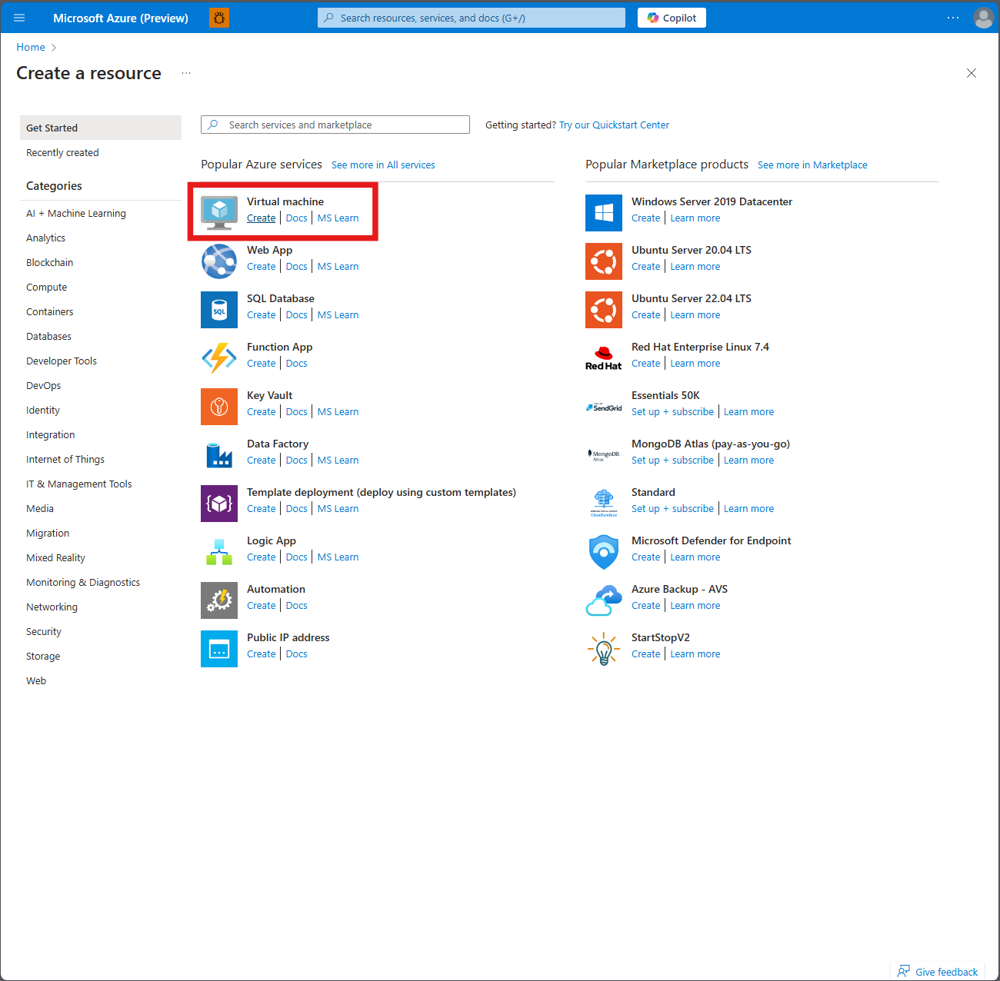

2. **Availability Options**
   - Choose "No Infrastructure redundancy required".

3. **Security Type**
   - Review the "Security type" field and select "Confidential Virtual Machines".
   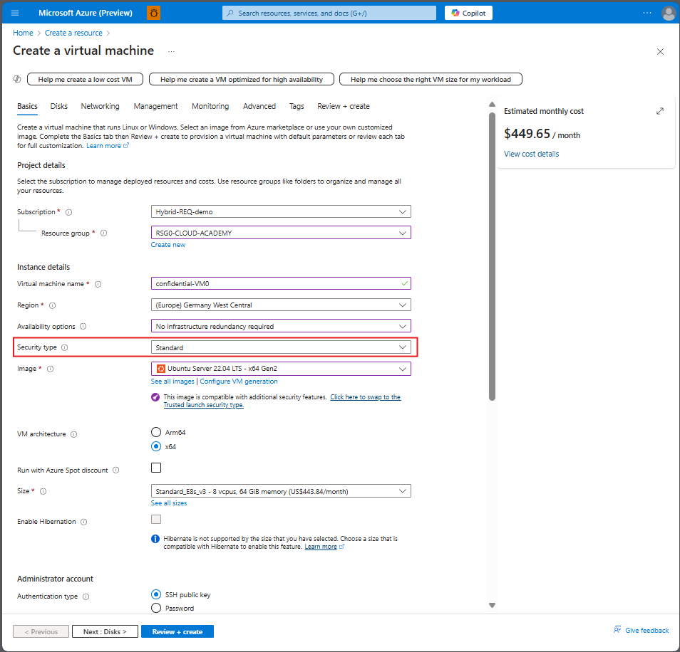

4. **Image Compatibility Warning**
   - If you see a warning message indicating that the chosen image does not support the selected security type, click on "See all images".
   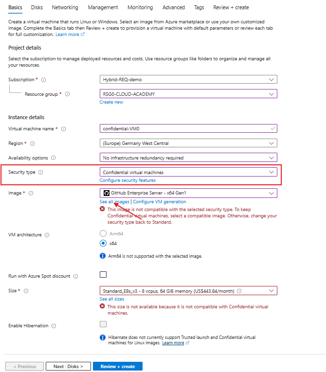

5. **Select a Confidential Image**
   - In the Marketplace window, find the filter called "Security Type".
   - Select "Confidential" from the Security Type dropdown.
   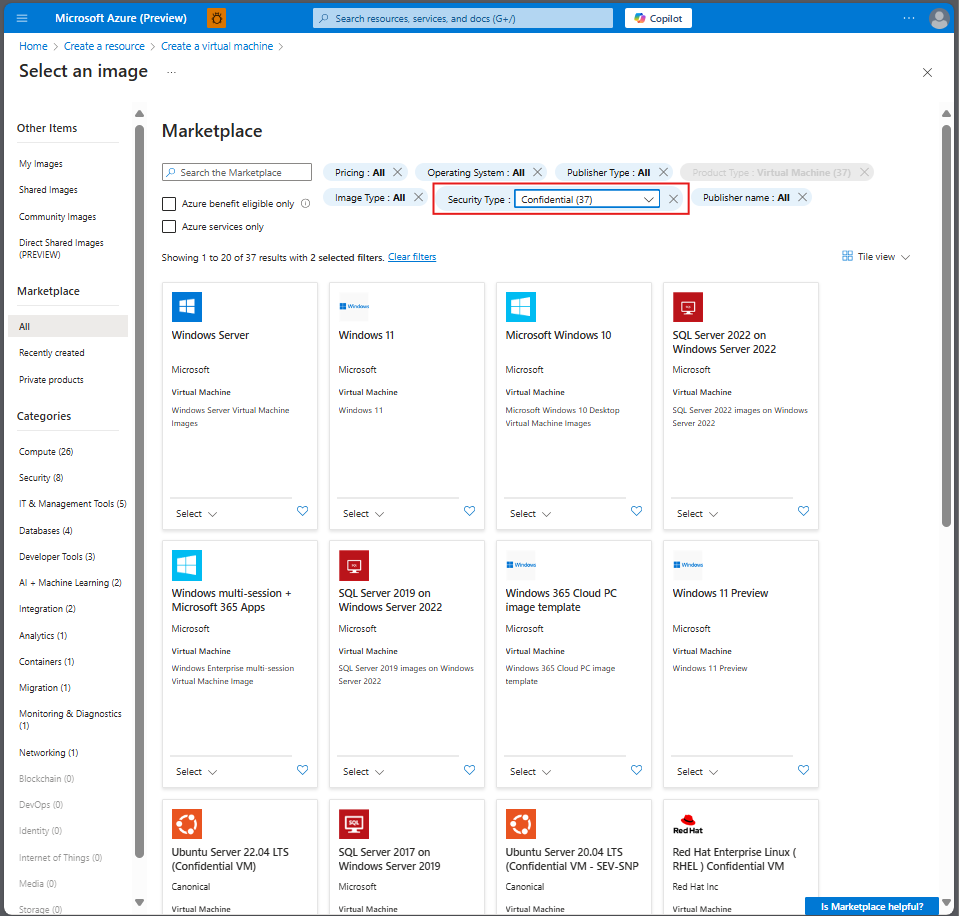

6. **Choosing the Image**
   - Click on "Select" and choose **"Ubuntu Server 22.04 LTS (Confidential VM) - x86 Gen 2"**.
   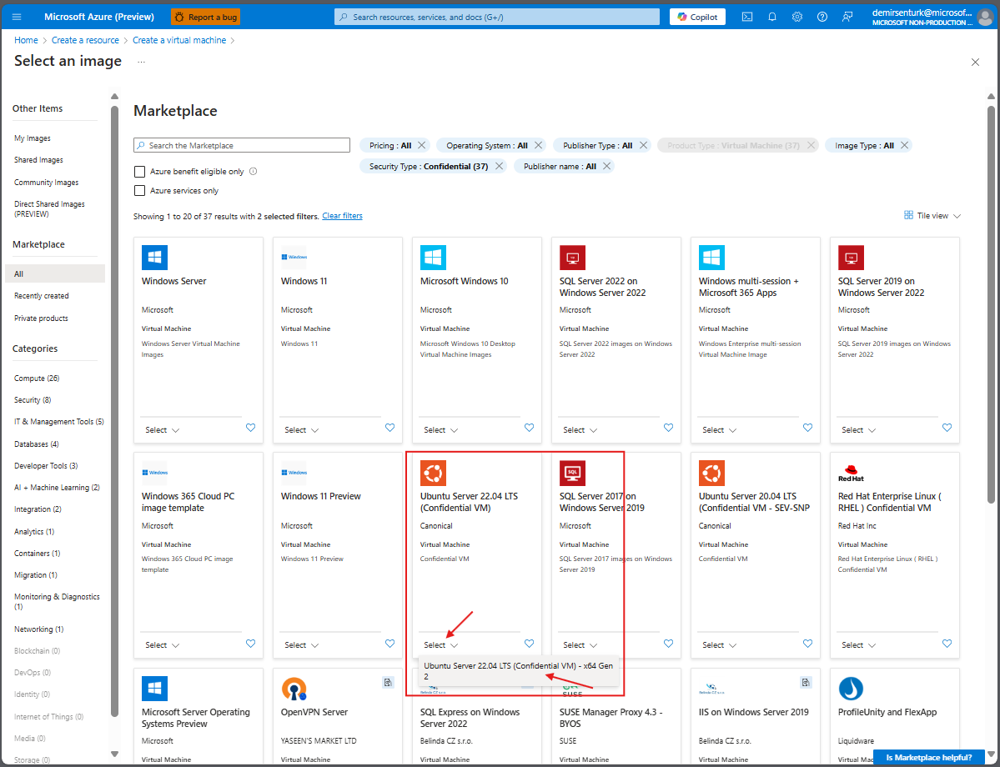

7. **VM Size Compatibility**
   - If the selected size is not compatible (you'll see a warning), click on "See all sizes" to review confidential VM sizes.
   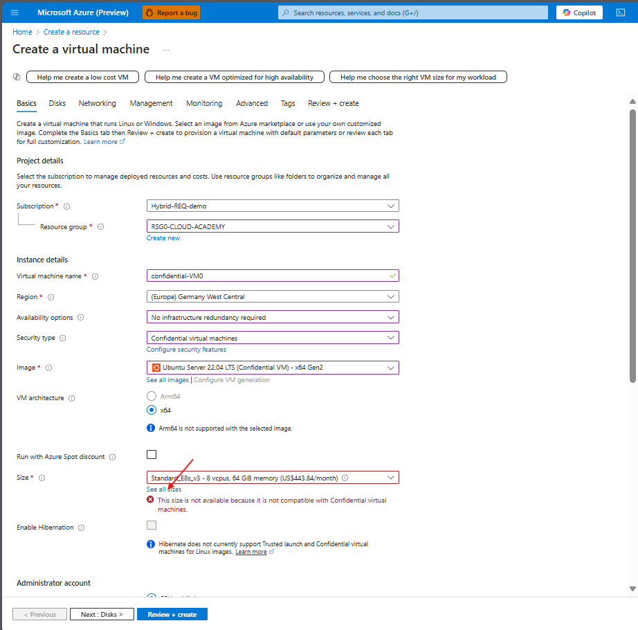

8. **Select a Compatible VM Size**
   - Choose a VM size from the DC-Series or EC-Series.
     - **Example:** [DC16as_v5](https://learn.microsoft.com/en-us/azure/virtual-machines/sizes/general-purpose/dcasv5-series?tabs=sizebasic)
     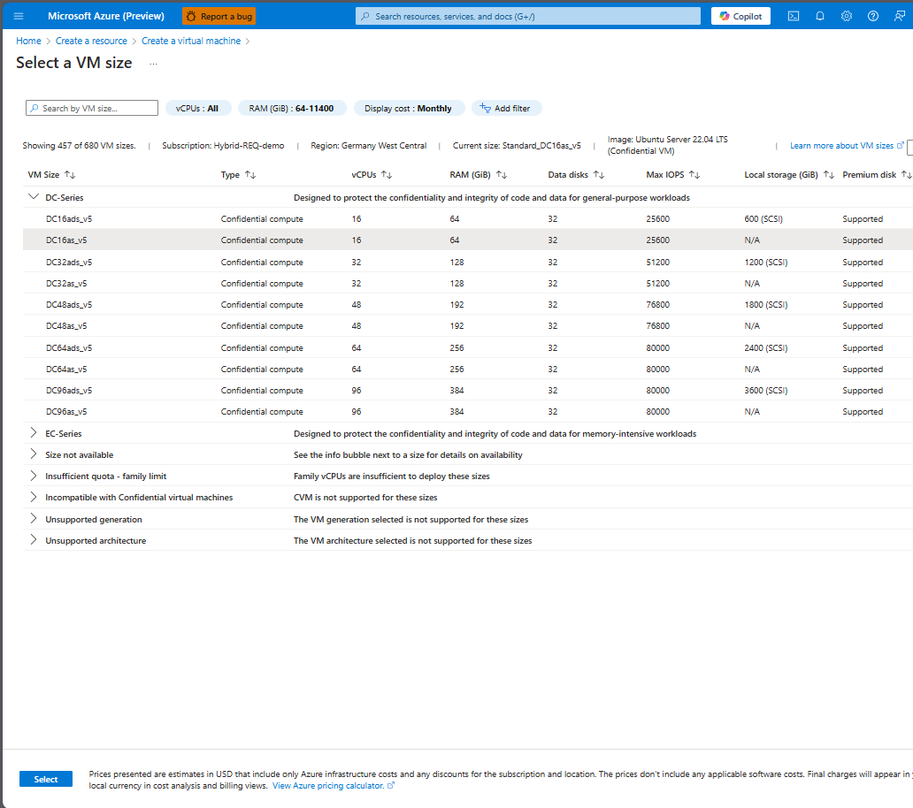
     - **Example:** [DC16as_v5](https://learn.microsoft.com/en-us/azure/virtual-machines/sizes/general-purpose/dcasv5-series?tabs=sizebasic)
     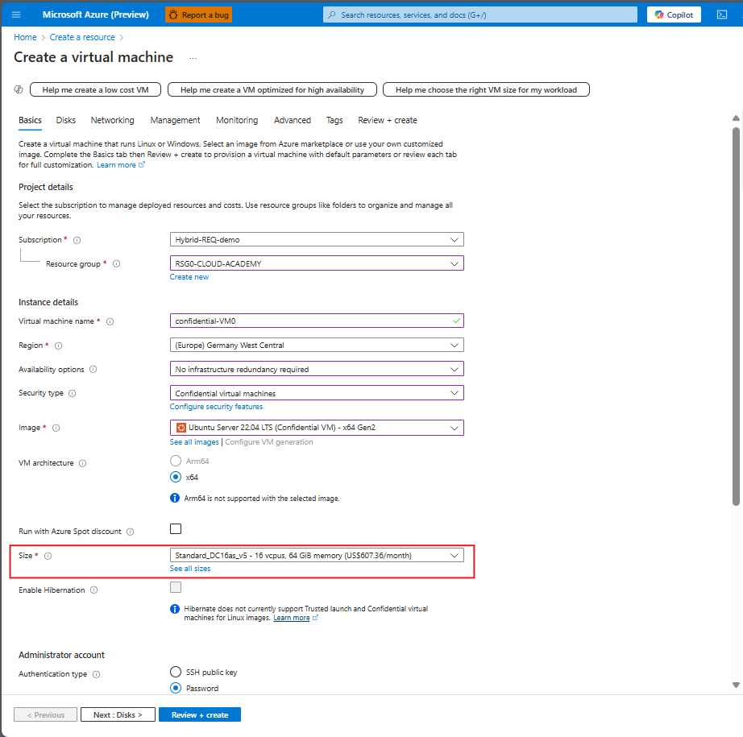

9. **Enable Confidential OS Disk Encryption**
   - Enable [Confidential OS disk encryption](https://learn.microsoft.com/en-us/azure/confidential-computing/confidential-vm-overview#confidential-os-disk-encryption).
   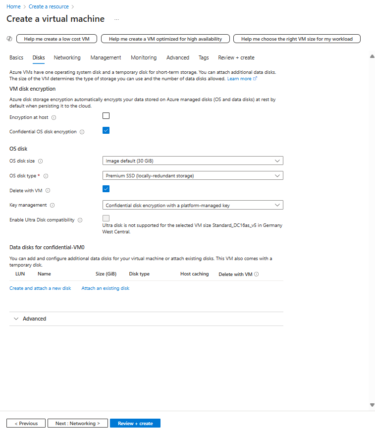

10. **Review Configuration**
    - Review your configuration settings to ensure everything is set up correctly.
    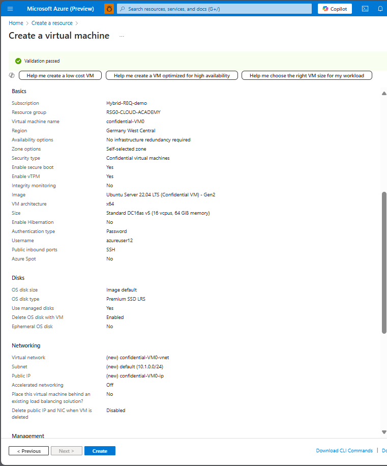

</details>

## Success Criteria 🎉

- 🎊 **Congratulations!** You have successfully deployed a Confidential Virtual Machine with a Confidential Boot Disk.

💡 **Learning Resources**:
- [Azure confidential VMs | Microsoft Learn](https://learn.microsoft.com/en-us/azure/confidential-computing/confidential-vm-overview) 
- [DC family VM size series - Azure Virtual Machines | Microsoft Learn](https://learn.microsoft.com/en-us/azure/virtual-machines/sizes/general-purpose/dc-family?tabs=dcasv5%2Cdcesv5%2Cdcasccv5%2Cdcsv3)


## Task 2: Connect to the Virtual Machine via SSH and Install the Attestation Library
### Objective:
Connect to the confidential VM, install the attestation library, and run the attestation client application.
### Success Criteria:
1. Connected to the confidential VM.
2. Attestation library and client installed.
3. Attestation executed.
4. JWT token response is decoded, and properties are validated.

### Instructions

#### Connect to the Virtual Machine
📘 **How-To Guide:** [Connect to confidential VM](https://learn.microsoft.com/en-us/azure/confidential-computing/quick-create-confidential-vm-portal#connect-to-confidential-vm)

#### Attestation - Installation Steps
Based on [Attestation App - Build Instructions for Linux](https://github.com/Azure/confidential-computing-cvm-guest-attestation/tree/main/cvm-attestation-sample-app#build-instructions-for-linux).

1. **Update `apt-get` Database:**
   ```sh
   sudo apt-get update
   ```

2. **Clone the `cvm-attestation-sample-app` Repository:**
   ```sh
   sudo git clone https://github.com/Azure/confidential-computing-cvm-guest-attestation.git
   ```

3. **Install Required Packages:**
   ```sh
   sudo apt-get install build-essential libcurl4-openssl-dev libjsoncpp-dev libboost-all-dev cmake nlohmann-json3-dev
   ```

   > Note: Certain warnings during installations are expected.  
   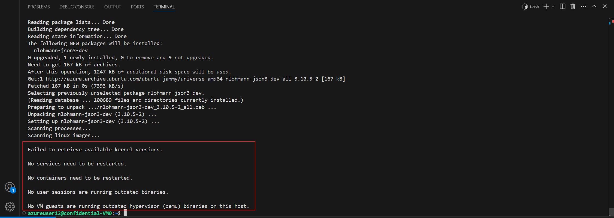

4. **Navigate to `cvm-attestation-sample-app` Folder:**
   ```sh
   cd cvm-attestation-sample-app/
   ```

5. **Download the Attestation Package:**
   ```sh
   sudo wget https://packages.microsoft.com/repos/azurecore/pool/main/a/azguestattestation1/azguestattestation1_1.0.5_amd64.deb
   ```

6. **Install the Attestation Package:**
   ```sh
   sudo dpkg -i azguestattestation1_1.0.5_amd64.deb
   ```

7. **Build and Run the Attestation App:**
   ```sh
   sudo cmake .
   sudo make
   sudo ./AttestationClient -o token
   ```

   > Expected Response:  
   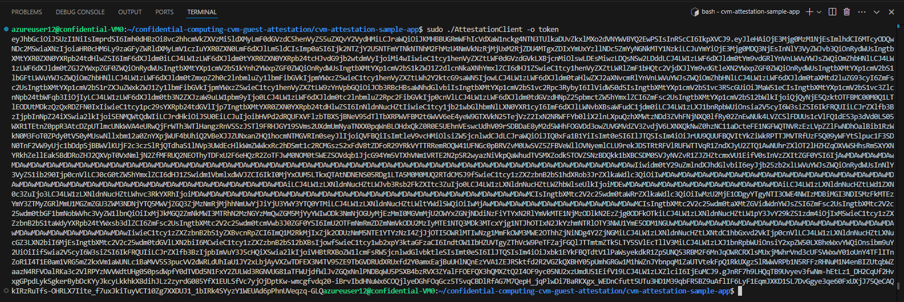

---

## Task 3: Decode the JWT Token Response
### Instructions
1. **Copy the JWT Token Response** from the previous task.
   > Example Response:  
   

2. **Use a tool like [JWT.IO](https://jwt.io/) to decode the JSON Web Token (JWT)**. Paste the response.

   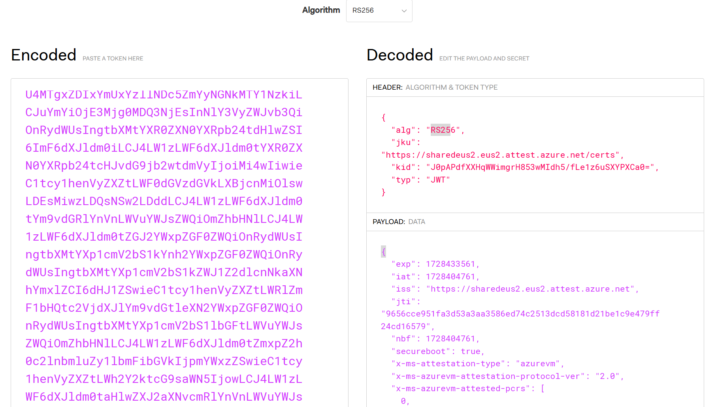

#### JWT Header Example
```json
{
  "alg": "RS256",
  "jku": "https://sharedeus2.eus2.attest.azure.net/certs",
  "kid": "J0pAPdfXXHqWWimgrH853wMIdh5/fLe1z6uSXYPXCa0=",
  "typ": "JWT"
}
```

#### Key Properties to Validate:
- **Secure Boot enabled**
- **Azure VM**

   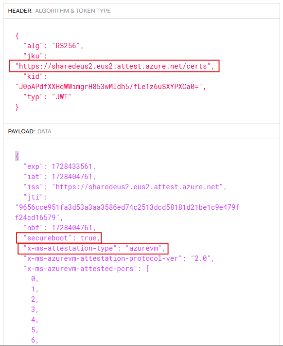

- **Ubuntu - Linux**
- **SEV-SNP enabled VM**
- **Azure compliant confidential VM**

   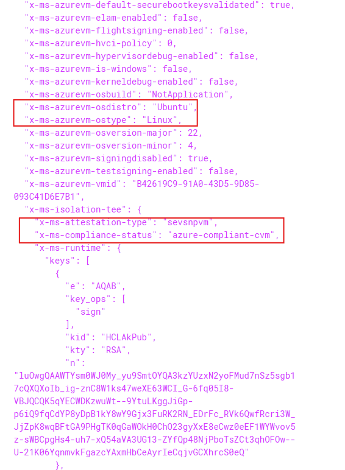

- **Microcode:** AMD microcode security version number (SVN)  
   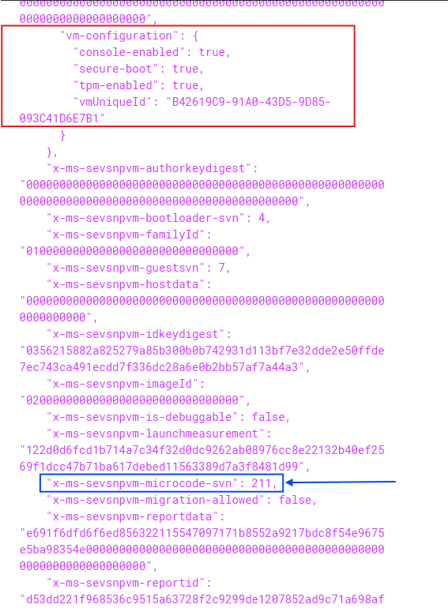

---

## 💡 Learning Checkpoint - Microcodes
### Microcode
Microcode security version number of the (AMD) processor can be also found under the attestation response.

**What are microcodes?** When processors are manufactured, they have a baseline microcode. This microcode is immutable and cannot be changed after the processor is built.

### Microcode Updates and Briefs
Microcode updates are essential for maintaining the security and stability of processors. These updates can address vulnerabilities, improve performance, and add new features. Here are some resources where you can find microcode updates and security briefings from hardware manufacturers:
- [AMD - Security Bulletins and Briefs](https://www.amd.com/en/resources/product-security.html)
- [Intel - Microcode Updates (MCU)](https://www.intel.com/content/www/us/en/security-center/advisory/intel-sa-00233.html)
- [How to Find the Microcode Version Currently Running on your Processor - Intel Support](https://www.intel.com/content/www/us/en/support/articles/000055672/processors.html)
- [MS Blog on Microcodes](https://techcommunity.microsoft.com/t5/core-infrastructure-and-security/demystifying-microcode-updates-for-intel-and-amd-processors/ba-p/1000845#:~:text=The%20security%20implications%20of%20why%20you%20should%20update%20the%20microcode)

### Additional Information
Microsoft Premier Field Engineer (PFE) Steve Mathias has provided some insights into the mechanics of [Microsoft Microcode Updates](https://techcommunity.microsoft.com/t5/core-infrastructure-and-security/demystifying-microcode-updates-for-intel-and-amd-processors/ba-p/1000845#:~:text=The%20security%20implications%20of%20why%20you%20should%20update%20the%20microcode).

   

## Review additional [properties](https://learn.microsoft.com/en-us/azure/attestation/claim-sets#sev-snp-attestation) that can be validated:

- TPM enabled
- VM unique ID

**TPM - Ephemeral Encryption Key**  
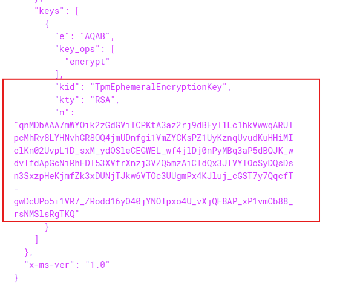

---

## Success Criteria 🎉
- 🎊 **Congratulations!** You have successfully:
  - Connected to the confidential VM.
  - Installed the attestation library and client.
  - Executed the attestation.
  - Decoded the JWT token response and validated its properties.

---

## Learning Resources
- [What is Attestation?](https://learn.microsoft.com/en-us/azure/confidential-computing/attestation-solutions#types-of-attestation)
- [Guest Attestation](https://github.com/Azure/confidential-computing-cvm-guest-attestation/blob/main/cvm-guest-attestation.md#azure-confidential-vms-attestation-guidance--faq)
- [Choose Between Confidential Deployment Models | Microsoft Learn](https://learn.microsoft.com/en-us/azure/confidential-computing/confidential-computing-deployment-models)

---

## Navigation
- **[< Previous Module 4 - Securing Data at Rest](../module-4/README.md)**
- **[Next Module 6 - Governance & Compliance >](../module-6/README.md)**