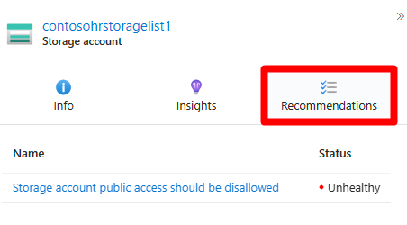

# Module 6 - Governance & Compliance

## Hands-On Tasks:

### Task 1 - Defender for Cloud Threat Protection
**Instructions:** Review and implement threat protection using Defender for Cloud.  
**Success criteria:** 
- Log Analytics workspace deployed.
- Microsoft Defender for Cloud activated.

 

💡 Hint: Defender for Cloud activation steps

 

1. Sign in to the [Azure portal](https://portal.azure.com/) with a user assigned the `Owner` or `Contributor` role in the Azure subscription required for this lab.

2. In the **Search resources, services, and docs** bar at the top, type **Microsoft Defender for Cloud** and press **Enter**.

3. In the left navigation panel, click **Getting started**. On the **Microsoft Defender for Cloud | Getting started** blade, navigate to the **Upgrade** tab.

    
     
4. Select a Log Analytics workspace and enable Defender for Cloud on the workspaces. Follow these instructions to create a Log Analytics workspace:

   📘 **How-To:** [Create a Log Analytics workspace](https://learn.microsoft.com/en-us/azure/azure-monitor/logs/quick-create-workspace?tabs=azure-portal)

   

5. On the **Upgrade** tab (under **Microsoft Defender for Cloud \| Getting started** blade) , scroll down to the **Select workspaces with enhanced security features** section. Turn on the **Microsoft Defender plan** by selecting your Log Analytics Workspace, then click the large blue **Upgrade** button.

    > **Note:** Review all features available as part of Microsoft Defender plans.

6. Navigate to **Microsoft Defender for Cloud** and, in the left navigation panel under the Management section, click **Environment Settings**.

7. On the **Microsoft Defender for Cloud \| Environment settings** blade, scroll down to the management group/subscription hierarchy. Expand the management groups until your subscription appears and click the relevant subscription.

8. On the **Settings | Defender plans** blade, select **Enable all plans** and click **Save**.

9. Navigate back to the **Microsoft Defender for Cloud \| Environment settings** blade, expand until your subscription appears, and click the entry representing the Log Analytics workspace you created in step 4. This would most likely to appear under your subscription on the hierachy.

10. Under the **Settings \| Defender plans** blade, ensure all options are "On". Click **Enable all plans** and then **Save** if needed.

11. Select **Data collection** from the **Settings | Defender plans** blade, click **All Events**, and **Save**.

    

### Task 2 - Review Recommendations and Secure Score
**Instructions:** Analyze security recommendations and secure scores.  
**Success criteria:** Identify the top 3 security recommendations to improve the security score.

💡 Hint: How to check security recommendations 

 
 
1. Sign in to the Azure portal.

2. Navigate to **Defender for Cloud > Recommendations**.

3. Select a recommendation.

4. Perform the following actions in the recommendation:
   - Select **Open query** to view detailed information about the affected resources using an Azure Resource Graph Explorer query.

     

   - Run the query and review the `riskLevel` associated with the recommendations.

     

   - Return to **Defender for Cloud > Recommendations** tab.

   - Click on one of the critical recommendations.

     

   - Select **View policy definition** to view the Azure Policy entry for the underlying recommendation.

     

**Take action options:**

- **Remediate:** A description of the manual steps required to remediate the security issue on the affected resources. For recommendations with the Fix option, you can select View remediation logic before applying the suggested fix to your resources.

- **Assign owner and due date:** If you have a governance rule turned on for the recommendation, you can assign an owner and due date.

- **Exempt:** You can exempt resources from the recommendation, or disable specific findings using disable rules.

- **Workflow automation:** Set a logic app to trigger with this recommendation.

📘 **How-To Guide:** [Review security recommendations](https://learn.microsoft.com/en-us/azure/defender-for-cloud/review-security-recommendations)

💡Hint: How to check security score

 
 
📘 **How-To Guide:** [**Track secure score**](https://learn.microsoft.com/en-us/azure/defender-for-cloud/secure-score-access-and-track)

### Task 3 - Determine which Defender Plans are Active
**Instructions:** Identify active Defender plans.  
**Success criteria:** Ensure the required plans are enabled and active.

💡Hint: Check enabled plans and disable if not required

 
 
📘 **How-To Guide:** [Select a Defender for Servers plan](https://learn.microsoft.com/en-us/azure/defender-for-cloud/tutorial-enable-servers-plan)

When you enable the Defender for Servers plan, you're then given the option to select which plan to enable. There are two plans - Plan 1 or Plan 2 - you can choose from that offer different levels of protections for your resources.

Compare the **[available features](https://learn.microsoft.com/en-us/azure/defender-for-cloud/plan-defender-for-servers-select-plan#plan-features)** provided by each plan.

To select a proper Defender for Servers plan:

1. Sign in to the [Azure portal](https://portal.azure.com).

2. Search for and select **Microsoft Defender for Cloud**.

3. In the Defender for Cloud menu, select **Environment settings**.

4. Select the relevant Azure subscription, AWS account or GCP project.

5. Under **Change plans**, configure the Defender for Servers plan correctly by selecting **Plan 1** or **Plan 2**.

    

6. Ensure that all unnecessary plans are disabled.
    
    

## Task 4 -Enable Attack Path Analysis
**Instructions:** Enable and utilize attack path analysis.  
**Success criteria:** The attack path page should show an overview of all attack paths, affected resources, and a list of active attack paths. 
  - You reviewed your affected resources and the list of active attack paths.

    

💡Hint: To identify attack paths

 
 
1. Sign in to the Azure portal.

2. Navigate to **Microsoft Defender for Cloud > Attack path analysis**.

    

3. Select an attack path.

4. Select a node.

    

5. Select **Insight** to view the associated insights for that node.

    

6. Select **Recommendations**.

    

7. Review the recommendation.

### Task 5 - View Current Policies and Standards
**Instructions:** Review the current governance policies and standards in place.  
**Success criteria:** 
    1. Familiarity with the Microsoft cloud security benchmark.
    2. NIST Special Publication (SP) 800-53 Rev. 5 or CIS Microsoft Azure Foundations Benchmark v2.0.0 enabled.

💡 **[Regulatory compliance standards in Microsoft Defender for Cloud](https://learn.microsoft.com/en-us/azure/defender-for-cloud/concept-regulatory-compliance-standards)**

💡Hint: To identify attack paths:

 
 
1. Sign in to the Azure portal.

2. Navigate to **Microsoft Defender for Cloud > Regulatory compliance**.

3. Check which **[Compliance Standards](https://learn.microsoft.com/en-us/azure/defender-for-cloud/concept-regulatory-compliance-standards)** are enabled.

    

4. Navigate to **Regulatory compliance > Environment Settings > Security Policies**.
- To do this, navigate to **Regulatory compliance** first and click **Manage compliance standards**.

    

    Navigation path: **Home > Microsoft Defender for Cloud > Regulatory compliance > Environment settings**

5. Scroll down and click on your subscription in the management hierarchy.

6. Navigate to the **Security policies** tab

Find the required **Security Policy** ``Security Policy NIST Special Publication (SP) 800-53 Rev. 5`` or ``CIS Microsoft Azure Foundations Benchmark v2.0.0`` and enable it.

**[Regulatory compliance standards in Microsoft Defender for Cloud](https://learn.microsoft.com/en-us/azure/defender-for-cloud/concept-regulatory-compliance-standards)**

## Success Criteria 🎉
- 🎊 **Congratulations!** You have successfully:
  - Deployed a Log Analytics workspace and activated Microsoft Defender for Cloud.
  - Analyzed and identified top security recommendations to improve your secure score.
  - Verified active Defender plans and ensured necessary plans are enabled.
  - Enabled attack path analysis and reviewed affected resources and active attack paths.
  - Reviewed and understood current governance policies and standards, including familiarity with Microsoft cloud security benchmark and NIST SP 800-53 or CIS Microsoft Azure Foundations Benchmark v2.0.0.
- ✅ **Security Hack**: Congratulations you have successfully completed the Security Hack! 🎉

## Navigation
**[< previous Module 5 - Securing Data in Use - Confidential Virtual Machines](../module-5/README.md) |**