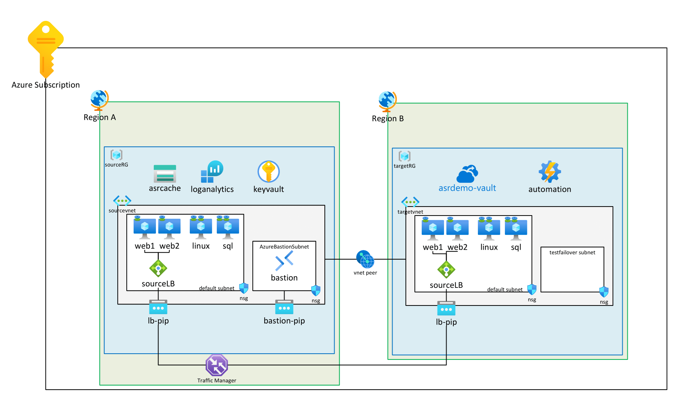
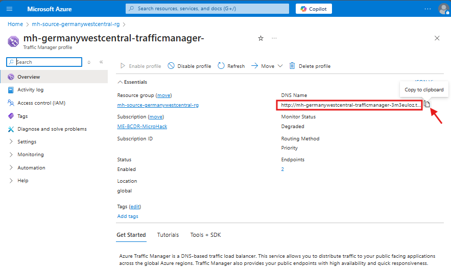
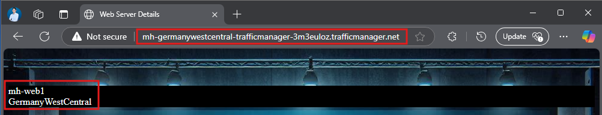

# Challenge - Prerequisites and Landing Zone Deployment

**[< back to Chapter 1](../README.md)**

---

## Goal 🎯

In this challenge you will deploy a complete lab environment with the networking and compute resources you learned about in Chapter 1. You will use **Infrastructure as Code (IaC)** to provision resources across two Azure regions, bringing together VNets, VMs, NSGs, Bastion, Load Balancers, and more — all in one deployment.

This is a practical exercise that reinforces the theory covered in Chapter 1 by deploying a realistic, multi-region Azure infrastructure.

---

## Architecture Overview

The deployment creates a hub-and-spoke network topology across two Azure regions. Below is the architecture diagram:



---

## Subscription Validation

Before deploying, validate that your Azure subscription meets the prerequisites:

1. Ensure you are logged in to the Azure CLI:
   ```bash
   az login
   az account show
   ```
2. Confirm you have **Owner** role at the subscription level.
3. Verify the following resource providers are registered:
   - `Microsoft.Compute`
   - `Microsoft.Network`
   - `Microsoft.Storage`
   - `Microsoft.RecoveryServices`
   - `Microsoft.KeyVault`
   - `Microsoft.OperationalInsights`
   - `Microsoft.Automation`
   - `Microsoft.DataProtection`
   - `Microsoft.SqlVirtualMachine`

   You can check and register them with:
   ```bash
   az provider register --namespace Microsoft.Compute
   az provider register --namespace Microsoft.RecoveryServices
   # ... repeat for each provider
   ```

---

## Deployment

Two deployment methods are available. Both use the same ARM template ([deploy.json](./deploy.json)) and parameter file ([main.parameters.json](./main.parameters.json)).

### Step 1 — Customize the Parameters

Open `main.parameters.json` and update:
- **`parDeploymentPrefix`**: Replace `<insertParticipantNumber>` with your assigned number (e.g., `mh01`).
- **`vmAdminPassword`**: Set a strong password that meets Azure complexity requirements (12+ characters, upper/lower case, digits, special characters).

### Step 2 — Deploy

#### Option A: Azure Portal (ARM Template Deployment)

1. Sign in to the [Azure Portal](https://portal.azure.com).
2. Search for **"Deploy a custom template"** and select it.
3. Click **Build your own template in the editor**.
4. Click **Load file** and upload `deploy.json`, then click **Save**.
5. Click **Edit parameters**, then **Load file** and upload `main.parameters.json`, then click **Save**.
6. Verify your **deployment prefix** and **VM admin password** are set.
7. Select or create a resource group for the deployment scope, then click **Review + Create** → **Create**.

#### Option B: Azure CLI (CloudShell or local terminal)

```bash
az deployment sub create \
  --location norwayeast \
  --template-file deploy.json \
  --parameters main.parameters.json \
  --parameters vmAdminPassword='<YourSecurePassword>'
```

> **Note:** This is a subscription-level deployment, so use `az deployment sub create` (not `az deployment group create`).

---

## Exploration of the Lab

After a successful deployment, you should see two new resource groups.

### What to verify

| Check | Details |
|---|---|
| **Resource Groups** | Two RGs created: `mh<number>-source-norwayeast-rg` and `mh<number>-target-swedencentral-rg` |
| **VNets & Peerings** | Hub, Source, Target, and Test VNets are created and peered |
| **Bastion** | Azure Bastion is deployed in the Hub VNet's `AzureBastionSubnet` |
| **VMs** | 4 VMs deployed: web1, web2, sql, linux — all in the source region |
| **Load Balancer** | Standard LBs in both source and target regions with public IPs |
| **NSGs** | Security rules on each subnet (HTTP inbound, Bastion ingress for RDP/SSH) |
| **Storage Account** | GRS-enabled storage in the source region |
| **Recovery Services Vaults** | Present in both regions with replication policies |
| **Traffic Manager** | Priority routing configured between source and target LB endpoints |

### Test the Web Application

The web application runs on IIS across `web1` and `web2`. Access it via the **Traffic Manager FQDN** (found in the deployment outputs or in the Azure Portal under the Traffic Manager profile).





---

## Success Criteria ✅

- [ ] Resource Groups created in both regions
- [ ] Hub & Spoke VNet topology established with peerings
- [ ] Azure Bastion deployed for secure VM access
- [ ] 4 VMs deployed (2× web with IIS, 1× SQL, 1× Linux)
- [ ] Load Balancers with health probes operational in both regions
- [ ] Recovery Services Vaults and Backup Vaults created
- [ ] Geo-redundant Storage Account created
- [ ] Traffic Manager routing to the web application
- [ ] Web application accessible via Traffic Manager FQDN

---

## Learning Resources 📚

- [Manage resource groups - Azure Portal](https://learn.microsoft.com/azure/azure-resource-manager/management/manage-resource-groups-portal)
- [Create a storage account](https://learn.microsoft.com/azure/storage/common/storage-account-create)
- [Create and configure Recovery Services vaults](https://learn.microsoft.com/azure/backup/backup-create-recovery-services-vault)
- [Deploy ARM templates via the Azure portal](https://learn.microsoft.com/en-us/azure/azure-resource-manager/templates/quickstart-create-templates-use-the-portal)
- [Hub-spoke network topology in Azure](https://learn.microsoft.com/en-us/azure/architecture/networking/architecture/hub-spoke)
- [Azure Bastion documentation](https://learn.microsoft.com/en-us/azure/bastion/bastion-overview)
- [Azure Load Balancer documentation](https://learn.microsoft.com/en-us/azure/load-balancer/load-balancer-overview)
- [Azure Traffic Manager documentation](https://learn.microsoft.com/en-us/azure/traffic-manager/traffic-manager-overview)

---

**[< back to Chapter 1](../README.md)**
