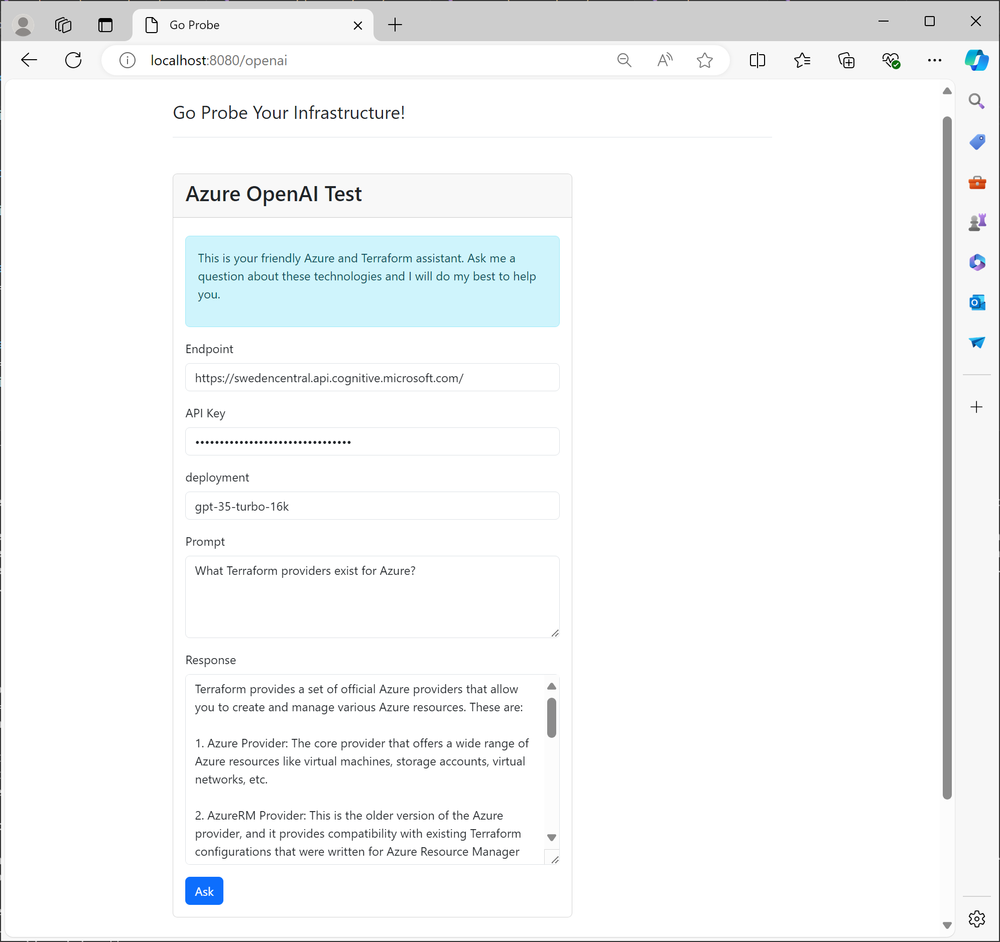

# 7 - Azure OpenAI
The final resource you will deploy is an Azure OpenAI service. This allows you to build ChatGPT-like experiences.

> **⚠️ Model Update (2025):** The `gpt-35-turbo-16k` model has been **deprecated since April 2025**. Use `gpt-4o-mini` (version `2024-07-18`) instead. See the [Day 4 OpenAI chapter](../../day4/chapter-6/README.md) for updated instructions.

## Objectives
- Create a Cognitive Account of type `OpenAI`.
- Place the account in your existing resource group in Sweden Central. 
- Select `S0` as SKU.
- Randomize the account name the same way you have randomized your resource group's name.
- Set a **custom subdomain name** (required for the API endpoint).
- Create a Cognitive Deployment using
    - `OpenAI` as model format
    - `gpt-4o-mini` as model name and resource name
    - `2024-07-18` as model version
    - `Standard` as scale type
    - a capacity of 20

> Capacity of 20 means 20,000 tokens per minute can be processed, or roughly 15,000 words if you are using English as language.

## Success Criteria
- You have created an Azure OpenAI endpoint that supports the `gpt-4o-mini` model and can process up to 20,000 tokens per minute.
- You can use the test application or the Azure Portal to interact with the model.

### Verification

**Option A — Azure Portal (easiest):**
1. Open the Azure Portal and navigate to your OpenAI resource
2. Click **Go to Azure AI Foundry portal**
3. In the **Chat** playground, select your `gpt-4o-mini` deployment
4. Ask a question — you should get a response

**Option B — Via PowerShell (if API keys are enabled):**
- On the test application's home page, click the OpenAI link
- Enter your endpoint, API key, deployment name (`gpt-4o-mini`), and a prompt
- Click "Ask"

> **Note:** In some training environments, API key authentication is disabled. Use the Azure Portal playground or Entra ID bearer tokens instead. See the [Day 4 chapter](../../day4/chapter-6/README.md) for bearer token instructions.

## Learning resources
- [azurerm_cognitive_deployment](https://registry.terraform.io/providers/hashicorp/azurerm/latest/docs/resources/cognitive_deployment)
- [azurerm_cognitive_account](https://registry.terraform.io/providers/hashicorp/azurerm/latest/docs/resources/cognitive_account)
- [Deploy and run a Azure OpenAI/ChatGPT app on AKS with Terraform](https://techcommunity.microsoft.com/t5/fasttrack-for-azure/deploy-and-run-a-azure-openai-chatgpt-app-on-aks-with-terraform/ba-p/3839611)

## Sample solution
See [here](../../solutions/chapter-7/complete/).

[Back](./README.md)