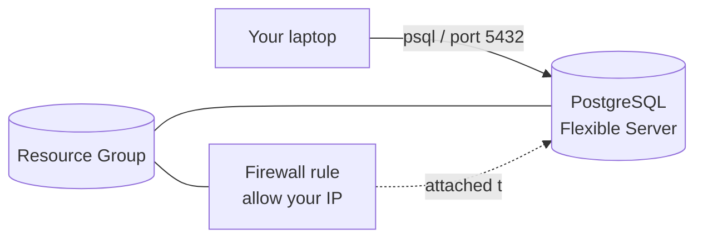

# 07 — Challenge: Deploy a PostgreSQL Flexible Server with Terraform

> **Level:** Beginner · **Time:** ~30 min of writing + ~7 min of waiting for Azure

## What you are going to build

In this challenge you will write a small Terraform configuration that
deploys an **Azure Database for PostgreSQL Flexible Server** with a
public endpoint, then connects to it from your laptop:



You will practice the building blocks from earlier challenges:

| From challenge | Concept used here |
|---|---|
| `01_intro` | `terraform init / plan / apply / destroy` |
| `02_providers` | declaring the `azurerm` provider |
| `03_variables` | input variables + outputs |
| `04_expressions` | a `count` conditional + a `validation` block |

> [!IMPORTANT]
> Creating a Flexible Server takes **5–8 minutes** and `terraform
> destroy` takes about the same (the resource group deletion blocks
> until the database is fully torn down). Both commands will look like
> they hang — they aren't, the Azure control plane is just slow.
> **Destroy as soon as you are done** so the server doesn't keep
> running (and billing) in the background.

---

## Two ways to do this challenge

- **Path A — Write it yourself (recommended).** Follow the steps below
  and create the four `.tf` files from scratch in an empty folder. This
  is where the learning happens.
- **Path B — Clone and deploy.** If you only have a few minutes, or you
  want a working baseline to compare against, jump to
  [Path B — Clone the solution](#path-b--clone-the-solution-and-deploy)
  at the bottom.

---

## Prerequisites

- Terraform `>= 1.5.0` — check with `terraform version`
- Azure CLI logged in: `az login`
- Subscription selected: `az account set --subscription <id>`
- The `Microsoft.DBforPostgreSQL` resource provider registered in your
  subscription (one-time, takes a few minutes):

  ```powershell
  az provider register --namespace Microsoft.DBforPostgreSQL --wait
  ```

---

## Path A — Build it yourself

Create a new empty folder anywhere on your machine and `cd` into it.
You will end up with five files:

```
my-pg-challenge/
├── versions.tf      # which Terraform + provider versions we need
├── providers.tf     # provider configuration
├── variables.tf     # inputs the user can change
├── main.tf          # the actual resources
└── outputs.tf       # what we want to print after apply
```

> [!TIP]
> Open VS Code in that folder (`code .`) and install the
> **HashiCorp Terraform** extension — you get autocomplete for every
> `azurerm_*` argument, which is the fastest way to learn the resource
> schema.

### Step 1 — `versions.tf`: pin Terraform and providers

We use the official `hashicorp/azurerm` provider for everything Azure,
plus `hashicorp/random` to generate a unique name suffix and a strong
password.

Create `versions.tf`:

```hcl
terraform {
  required_version = ">= 1.5.0"
  required_providers {
    azurerm = {
      source  = "hashicorp/azurerm"
      version = "~> 3.100"
    }
    random = {
      source  = "hashicorp/random"
      version = "~> 3.5"
    }
  }
}
```

### Step 2 — `providers.tf`: configure the providers

Create `providers.tf`:

```hcl
provider "azurerm" {
  features {}
}

provider "random" {}
```

The empty `features {}` block is **required** by the `azurerm` provider
even when you don't change anything.

### Step 3 — `variables.tf`: inputs

We want three knobs:

- `location` — which Azure region to deploy to
- `admin_login` — the PostgreSQL admin user (never `admin` / `root`,
  those are reserved by Azure)
- `client_ip` — an optional IPv4 address that should be allowed to reach
  the server (empty = no firewall rule, server is unreachable)

Create `variables.tf`:

```hcl
variable "location" {
  description = "Azure region for the resource group and PostgreSQL server."
  type        = string
  default     = "West Europe"
}

variable "admin_login" {
  description = "PostgreSQL administrator login name."
  type        = string
  default     = "pgadmin"
}

variable "client_ip" {
  description = "Optional public IPv4 of your workstation. Leave empty to skip the firewall rule."
  type        = string
  default     = ""

  validation {
    condition     = var.client_ip == "" || can(regex("^([0-9]{1,3}\\.){3}[0-9]{1,3}$", var.client_ip))
    error_message = "client_ip must be empty or a plain IPv4 address like 203.0.113.42."
  }
}
```

The `validation` block stops Terraform **before** it ever calls Azure if
you pass something that isn't an IPv4 — much faster feedback than waiting
for an API error.

### Step 4 — `main.tf`: the resources

This is the heart of the challenge. We need four resources:

1. `random_pet` — a short funny name (`huge-tetra`, `needed-bluebird`)
   we'll reuse as a suffix so participants don't collide on globally
   unique names.
2. `random_password` — the admin password.
3. `azurerm_resource_group` — the container for everything else.
4. `azurerm_postgresql_flexible_server` — the database itself.
5. (Optional) `azurerm_postgresql_flexible_server_firewall_rule` — only
   created when the user provides `client_ip`.

Create `main.tf`:

```hcl
# 1. A short random suffix so two participants can run this in parallel
#    without name collisions (server FQDNs are globally unique).
resource "random_pet" "id" {
  length    = 2
  separator = "-"
}

# 2. Strong random admin password. Stored in state and exposed only via a
#    `sensitive` output below.
resource "random_password" "admin" {
  length           = 24
  special          = true
  override_special = "_-"
  min_upper        = 1
  min_lower        = 1
  min_numeric      = 1
  min_special      = 1
}

# 3. Resource group.
resource "azurerm_resource_group" "rg" {
  name     = "rg-pg-${random_pet.id.id}"
  location = var.location
}

# 4. The PostgreSQL Flexible Server.
resource "azurerm_postgresql_flexible_server" "pg" {
  name                          = "pg-${random_pet.id.id}"
  resource_group_name           = azurerm_resource_group.rg.name
  location                      = azurerm_resource_group.rg.location
  version                       = "16"
  sku_name                      = "B_Standard_B1ms" # cheapest burstable tier
  storage_mb                    = 32768             # 32 GiB, the minimum
  administrator_login           = var.admin_login
  administrator_password        = random_password.admin.result
  public_network_access_enabled = true

  # We deliberately do NOT set `zone`. Not every subscription has quota
  # in every availability zone (you might get
  # `AvailabilityZoneNotAvailable`), so we let Azure pick one. The
  # lifecycle block keeps Terraform from trying to revert Azure's choice
  # on later applies.
  lifecycle {
    ignore_changes = [zone, high_availability]
  }
}

# 5. Optional firewall rule — only created when `client_ip` is set.
#    `count = 0` means "don't create this resource"; `count = 1` means
#    "create exactly one".
resource "azurerm_postgresql_flexible_server_firewall_rule" "client" {
  count            = var.client_ip == "" ? 0 : 1
  name             = "allow-client-ip"
  server_id        = azurerm_postgresql_flexible_server.pg.id
  start_ip_address = var.client_ip
  end_ip_address   = var.client_ip
}
```

> [!NOTE]
> **Why `B_Standard_B1ms` / 32 GiB / version 16?**
> They are the smallest valid combination Azure accepts today. Smaller
> and the API rejects the request; bigger and you pay more for a lab
> you'll destroy in 30 minutes.

### Step 5 — `outputs.tf`: print what we need

After `apply` we want to see the FQDN, the resource group, the admin
login, and be able to read the password securely:

```hcl
output "resource_group_name" {
  description = "Name of the resource group that owns the server."
  value       = azurerm_resource_group.rg.name
}

output "postgres_server_name" {
  description = "Short name of the PostgreSQL Flexible Server."
  value       = azurerm_postgresql_flexible_server.pg.name
}

output "postgres_fqdn" {
  description = "Fully-qualified DNS name to connect to (port 5432)."
  value       = azurerm_postgresql_flexible_server.pg.fqdn
}

output "postgres_admin_login" {
  description = "Administrator login name."
  value       = azurerm_postgresql_flexible_server.pg.administrator_login
}

output "postgres_admin_password" {
  description = "Read with: terraform output -raw postgres_admin_password"
  value       = random_password.admin.result
  sensitive   = true
}
```

`sensitive = true` hides the password from the apply log; you can still
read it with `terraform output -raw postgres_admin_password`.

### Step 6 — Deploy

```powershell
terraform init      # download the providers
terraform validate  # syntax check (free, fast)
terraform plan      # show what will be created (free, fast)
terraform apply -auto-approve
```

Expect output similar to:

```
azurerm_postgresql_flexible_server.pg: Still creating... [05m56s elapsed]
azurerm_postgresql_flexible_server.pg: Creation complete after 6m5s
...
Apply complete! Resources: 4 added, 0 changed, 0 destroyed.

Outputs:
  postgres_fqdn        = "pg-needed-bluebird.postgres.database.azure.com"
  postgres_server_name = "pg-needed-bluebird"
  resource_group_name  = "rg-pg-needed-bluebird"
  postgres_admin_login = "pgadmin"
  postgres_admin_password = <sensitive>
```

The server exists, but **no client can reach it yet** — its firewall is
empty. Verify the deployment with the Azure CLI:

```powershell
az postgres flexible-server show `
  --name (terraform output -raw postgres_server_name) `
  --resource-group (terraform output -raw resource_group_name) `
  -o table
```

### Step 7 — (Optional) open the firewall and connect

Look up your public IP, then re-apply with `client_ip`:

> [!NOTE]
> **Use a service that returns plain text.** `ifconfig.me` returns an
> HTML page when called from PowerShell (it sniffs the User-Agent), and
> Terraform's validation block will reject the result. Use
> `https://api.ipify.org` as shown.

**PowerShell:**

```powershell
$myIp = (Invoke-RestMethod https://api.ipify.org).Trim()
"My IP: $myIp"
terraform apply -auto-approve -var "client_ip=$myIp"
```

**bash:**

```bash
MY_IP=$(curl -s https://api.ipify.org)
echo "My IP: $MY_IP"
terraform apply -auto-approve -var "client_ip=$MY_IP"
```

This time Terraform should report `Resources: 1 added` — only the
firewall rule changed, the server was untouched (this is Terraform's
desired-state model in action: re-running `apply` is safe).

Install `psql` and connect:

- Windows: `winget install PostgreSQL.psql`
- macOS: `brew install libpq`
- Ubuntu/Debian: `sudo apt install postgresql-client`

```powershell
$env:PGPASSWORD = terraform output -raw postgres_admin_password
psql "host=$(terraform output -raw postgres_fqdn) user=pgadmin dbname=postgres sslmode=require"
```

Inside `psql`, run a smoke test:

```sql
SELECT version();
```

Type `\q` to quit.

### Step 8 — Destroy

```powershell
terraform destroy -auto-approve
```

This deletes all 4 (or 3 if you skipped the firewall rule) resources.
Expect another **~7 minutes** of waiting.

---

## Path B — Clone the solution and deploy

If you just want a working baseline:

```powershell
git clone https://github.com/Azure/Azure-Hacks.git
cd Azure-Hacks/solutions/chapter-5/07_postgresql
terraform init
terraform apply -auto-approve
```

The files in this folder are the reference implementation of Path A —
read [`main.tf`](main.tf) side-by-side with the Path A walkthrough to
see why each line is there.

Don't forget:

```powershell
terraform destroy -auto-approve
```

---

## What you should take away

- The `azurerm_postgresql_flexible_server` resource type, its required
  arguments, and the Burstable SKU naming (`B_Standard_B1ms`).
- The `random_pet` + `random_password` pattern for unique, beginner-safe
  resource names and credentials without committing secrets.
- `count = var.x == "" ? 0 : 1` as the simplest **conditional resource**
  in Terraform.
- `sensitive = true` outputs are still in state but hidden from logs.
- `validation {}` on a variable gives instant feedback **before** Azure
  is ever called.
- Some Azure resources are **slow** (5–8 min). Plan demos accordingly
  and always `destroy` to avoid surprise bills.

---

## Troubleshooting

**`MissingSubscriptionRegistration` for `Microsoft.DBforPostgreSQL`**
Run the registration command in [Prerequisites](#prerequisites) and
wait a few minutes before retrying `terraform apply`.

**`AvailabilityZoneNotAvailable: Availability zone '1' isn't available`**
Your subscription has no quota in that zone in the chosen region. This
config does **not** hardcode a zone for that reason — Azure picks one
automatically. If you ever pin `zone = "1"` manually and see this
error, either remove the line or try zone `2` / `3`.

**`The location '...' is not accepting creation of new ... Flexible Server`**
The region temporarily has no capacity for the B-series. Override the
location:

```powershell
terraform apply -auto-approve -var "location=North Europe"
```

**`InvalidParameterValue: ... administrator_login ... reserved`**
`admin`, `azure_superuser`, `root`, etc. are not allowed. The default
`pgadmin` is safe; if you change it, avoid those keywords.

**`client_ip must be empty or a plain IPv4 address`**
Your IP-lookup command returned something other than a plain IPv4
string (most commonly an HTML page from `ifconfig.me`). Use
`https://api.ipify.org` as shown in Step 7.

**Apply succeeded but `psql` times out**
Your IP isn't in the firewall. Re-run Step 7 with the right `client_ip`,
or double-check that your network doesn't egress through a different
public address than `api.ipify.org` reports.

**`Error acquiring the state lock`**
A previous `terraform` process is still running (e.g. the long apply
hasn't finished). Wait for it to exit, then retry. As a last resort:
`terraform force-unlock <LOCK_ID>` — but only if you are sure no other
apply is in progress.

---

**[< back to Chapter 5 solutions](../README.md)**
